# Storage Engine Course: mmap Copy-on-Write B+trees in Go

This course is the long-form guide to the repository. It treats the project as a
small storage-engine research kernel: not a production database, but serious
enough to make the important mechanics concrete in code.

The implementation line is inspired by OpenLDAP MDB/LMDB: one mapped file,
fixed-size pages, copy-on-write updates, checked metadata pages, one serialized
writer, read-only snapshots, reader watermarks, page recycling, and explicit
kernel page-cache advice. The contrast line is OpenDJ/Berkeley DB Java Edition:
log files, a managed heap cache, cleaner work, and recovery from logged state.

Use this document as a course. Each module explains a term, shows a diagram,
then points to exact code in this repository.

## Module 0: What This Repository Is

The repository has two teaching layers.

- `btree` is the logical copy-on-write tree: easy to read, generic, and useful
  for learning path copying without byte pages.
- `pagebtree` is the storage-engine kernel: fixed `[4096]byte` pages, slotted
  records, page IDs, branch child pointers, overflow pages, mmap persistence,
  reader tables, reclaim metadata, kernel hints, and validation.

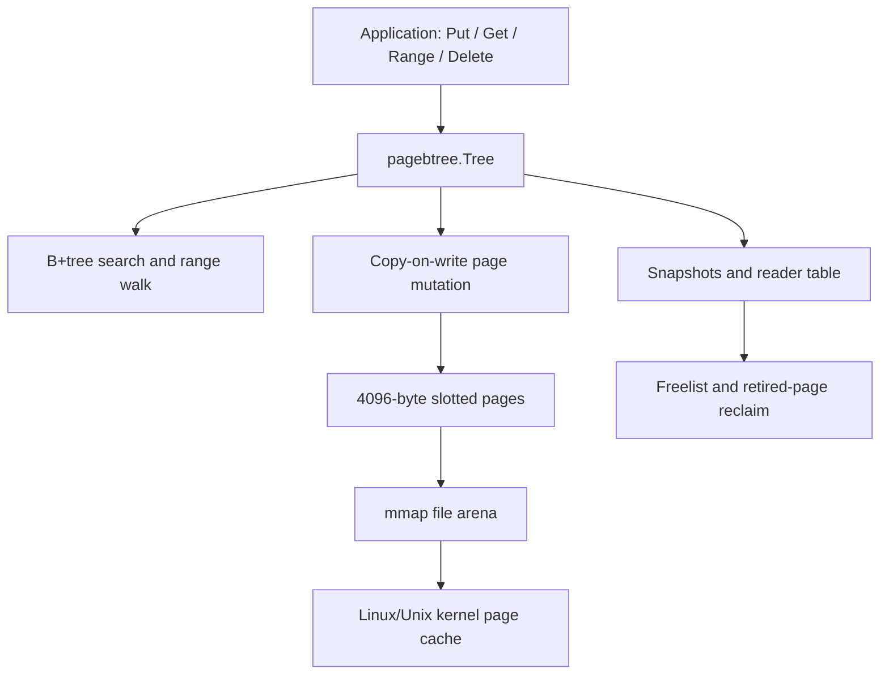

Code to read:

- Public tree state: [`pagebtree/tree.go#L5-L27`](../pagebtree/tree.go#L5-L27)
- Research profile surface: [`pagebtree/kernel_profile.go#L3-L46`](../pagebtree/kernel_profile.go#L3-L46)
- mmap open path: [`pagebtree/mmap.go#L92-L198`](../pagebtree/mmap.go#L92-L198)

## Module 1: B-tree, B+tree, and Why Engines Use Pages

A B-tree keeps keys sorted and shallow by storing many keys per node. A B+tree
variant keeps user values in leaves and uses internal branch pages only for
routing. That shape is common in storage engines because range scans can walk
leaves in order, while point lookups descend through branch pages.

In this repository, branch pages store separator keys and child page IDs. Leaf
pages store key/value cells. The public API does not expose page IDs, but the
engine uses them everywhere internally.

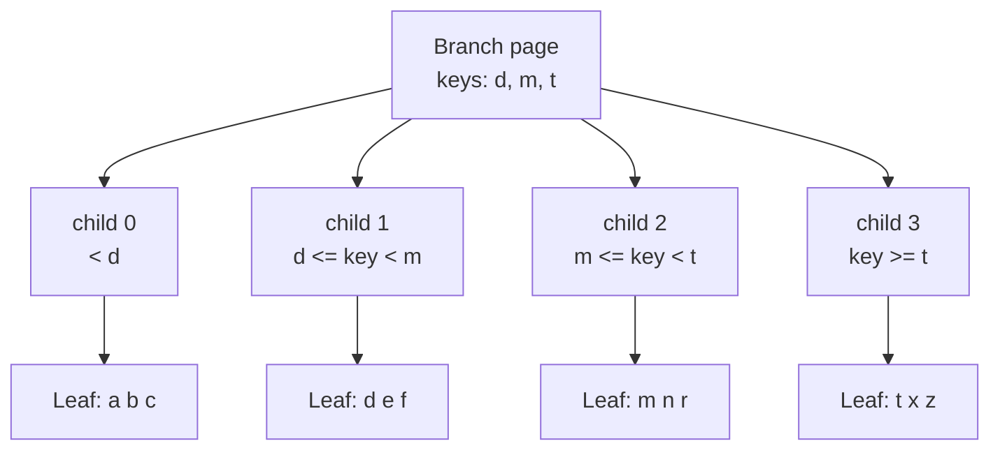

Important detail: this project uses B+tree-style leaves, but the branch search
semantics are intentionally simple. The leftmost child handles keys before the
first separator. A separator cell's value stores the child page ID for keys
equal to or greater than that separator until the next separator.

Code to read:

- Branch page encoding: [`pagebtree/insert.go#L165-L178`](../pagebtree/insert.go#L165-L178)
- Child routing from a branch page: [`pagebtree/page.go#L378-L387`](../pagebtree/page.go#L378-L387)
- `Get` descends page by page: [`pagebtree/search.go#L16-L34`](../pagebtree/search.go#L16-L34)

## Module 2: Slotted Pages

A slotted page is a fixed-size byte page split into three regions:

- A fixed header at the front.
- A slot directory that grows right.
- Variable-size cells that grow left.

This is a classic database-page trick. The slot directory lets the page keep
keys in sorted logical order while cell bytes live elsewhere in the same page.
Cells can vary in size because a slot records offset, key length, value length,
and flags.

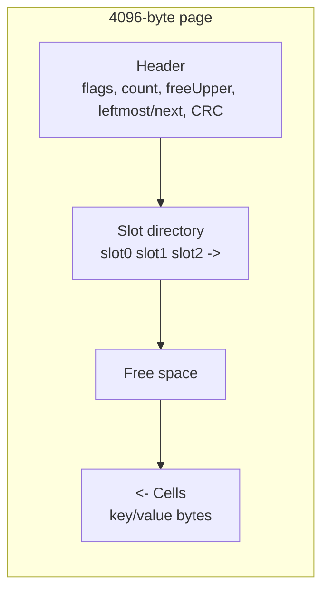

The core invariant is:

```text
header | slots grow right | free space | cells grow left
```

When a cell is appended, the code first checks the gap between the slot
directory and `freeUpper`. Then it copies the key and value into the cell area,
writes a slot entry, moves `freeUpper`, increases the slot count, and refreshes
the checksum.

Code to read:

- Page size and slotted-page comment: [`pagebtree/page.go#L10-L13`](../pagebtree/page.go#L10-L13)
- Header offsets and page flags: [`pagebtree/page.go#L23-L40`](../pagebtree/page.go#L23-L40)
- Slot shape: [`pagebtree/page.go#L42-L47`](../pagebtree/page.go#L42-L47)
- Appending a cell: [`pagebtree/page.go#L405-L430`](../pagebtree/page.go#L405-L430)
- Layout validation: [`pagebtree/page.go#L175-L225`](../pagebtree/page.go#L175-L225)

## Module 3: Searching a Slotted Page

The lookup algorithm has two levels.

First, the tree walk starts at the root page ID. If the page is a leaf, it
binary-searches the page's slot keys and returns the matching value. If the page
is a branch, it binary-searches the separator keys and chooses the next child
page ID.

Second, the page-level binary search does not decode all cells. It compares the
target key against keys found through the slot directory. That is the point of
slotted pages: the slot says where the key bytes are.

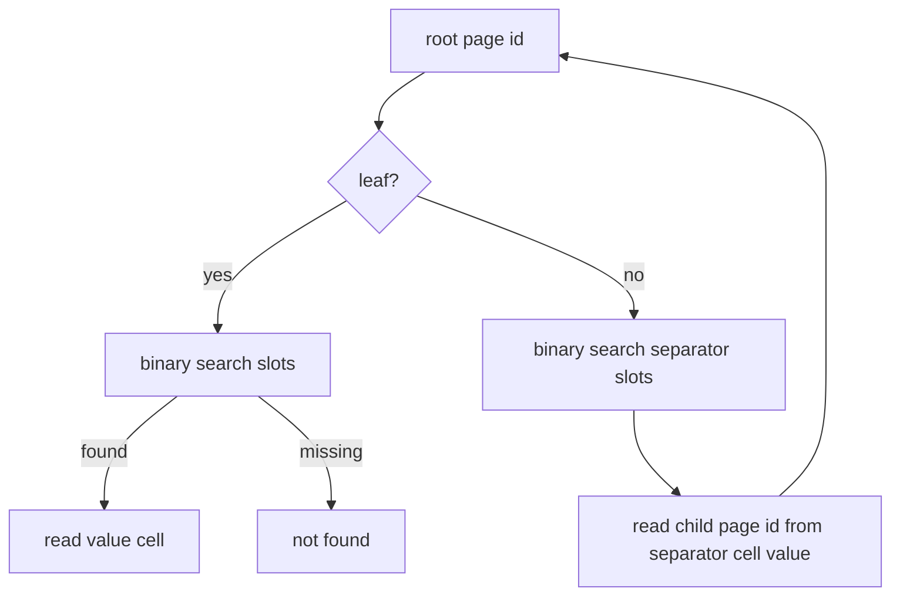

This answers the common storage-engine question: yes, the branch cell value is
the child page ID. In this code, the leftmost child page ID is stored in the page
header and every other child is stored as an 8-byte page ID in the separator
cell's value.

Code to read:

- Whole tree lookup loop: [`pagebtree/search.go#L16-L34`](../pagebtree/search.go#L16-L34)
- Leaf cell lookup: [`pagebtree/page.go#L362-L368`](../pagebtree/page.go#L362-L368)
- Branch child lookup: [`pagebtree/page.go#L378-L387`](../pagebtree/page.go#L378-L387)
- Slot binary search: [`pagebtree/page.go#L389-L403`](../pagebtree/page.go#L389-L403)
- Slot key comparison without decoding full pages: [`pagebtree/page.go#L330-L352`](../pagebtree/page.go#L330-L352)
- Branch cells encode child page IDs: [`pagebtree/insert.go#L170-L177`](../pagebtree/insert.go#L170-L177)

## Module 4: Copy-on-Write Path Copying

Copy-on-write means a writer does not mutate the old visible page path. It
copies the root, then copies each page on the search path before changing it.
After the new path is ready, the tree publishes a new root page ID and revision.
Old snapshots still hold the old root and can keep reading old pages.

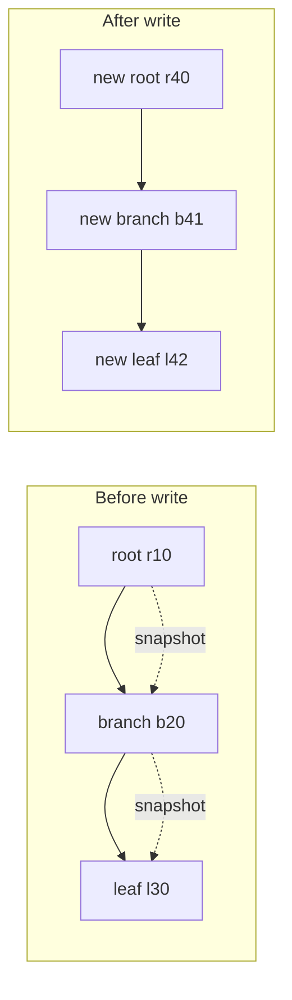

This model trades extra writes for simple snapshot isolation. Readers never need
to lock a page against mutation because the writer publishes new page IDs
instead of changing pages reachable from older roots.

Code to read:

- `Put` copies the root and publishes a new root: [`pagebtree/tree.go#L63-L100`](../pagebtree/tree.go#L63-L100)
- `copyPage` allocates a new page ID and retires the old one: [`pagebtree/tree.go#L220-L227`](../pagebtree/tree.go#L220-L227)
- Recursive insertion copies child pages before descent: [`pagebtree/insert.go#L58-L77`](../pagebtree/insert.go#L58-L77)
- Snapshots pin a root and revision: [`pagebtree/tree.go#L179-L191`](../pagebtree/tree.go#L179-L191)

## Module 5: Insertion, Splits, and Separators

Insertion starts by finding the child path for the key. If the leaf has space,
the new key/value is inserted there. If it overflows by key count, the leaf is
split at the legal position closest to half of the encoded leaf-cell bytes, and
the first key of the right leaf becomes the separator inserted into the parent.

Branches split similarly, but a branch split promotes the legal separator that
best balances encoded branch-cell bytes across the left and right branch pages.

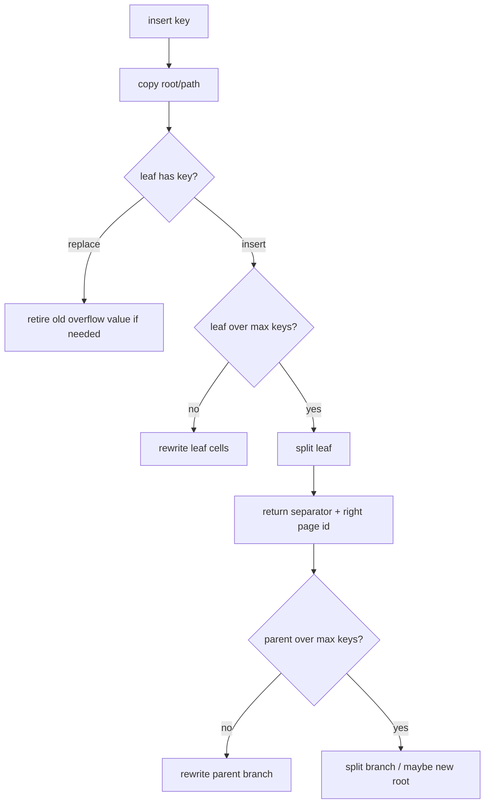

The code still favors clarity over byte-perfect production balancing. It has a
degree-based maximum key count, uses byte-aware split points for leaf and branch
overflow, and has additional overflow handling for large values that do not fit
well inside a leaf page. Leaf delete redistribution reuses the same byte-aware
split policy, and branch delete redistribution chooses a byte-aware child split.
Leaf and branch repair can also trigger on low byte occupancy when the page is
at the minimum key count.

Code to read:

- Leaf insert and split: [`pagebtree/insert.go#L26-L56`](../pagebtree/insert.go#L26-L56)
- Byte-aware leaf split-point selection: [`pagebtree/insert.go#L58-L108`](../pagebtree/insert.go#L58-L108)
- Branch descent and split: [`pagebtree/insert.go#L110-L146`](../pagebtree/insert.go#L110-L146)
- Byte-aware branch split-point selection: [`pagebtree/insert.go#L148-L185`](../pagebtree/insert.go#L148-L185)
- New root after split: [`pagebtree/tree.go#L83-L91`](../pagebtree/tree.go#L83-L91)
- Leaf rewrite with overflow fallback: [`pagebtree/insert.go#L197-L221`](../pagebtree/insert.go#L197-L221)

## Module 6: Delete, Merge, Redistribution, and Root Collapse

Delete is also copy-on-write. It first confirms the key exists, then copies the
root and descent path. It removes the leaf entry, retires overflow pages if the
value was large, and repairs underfull leaves or branches by merging or
redistributing with siblings. Finally it collapses a root that no longer needs
to be a branch.

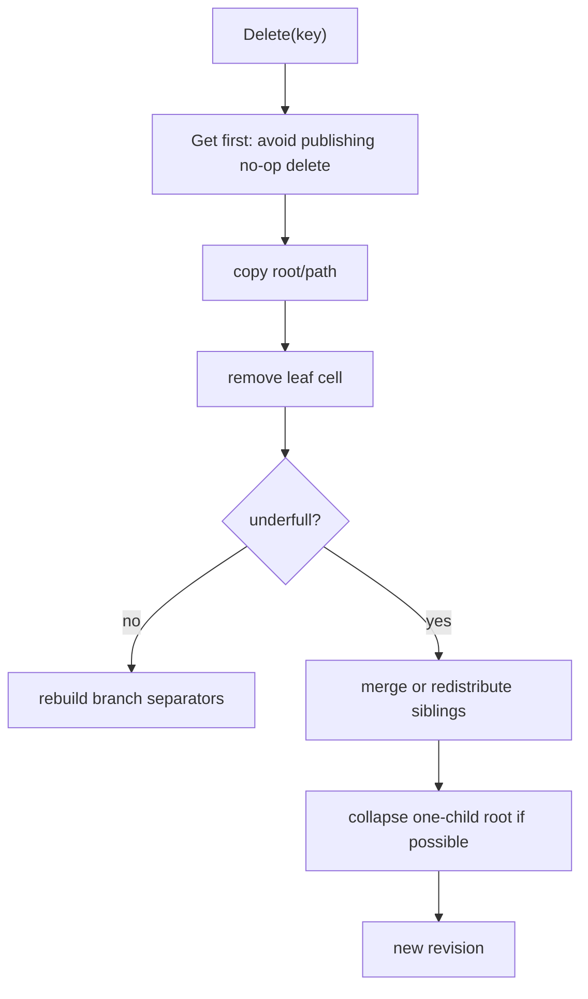

This is not a full production delete implementation. It has real merge and
redistribution behavior, and both leaf and branch redistribution choose
byte-aware split points. Leaf and branch repair now have conservative
byte-occupancy triggers. The default trigger repairs a minimum-key page below
25 percent byte fill; `Options.MinRepairPageFillPercent` and
`MmapOptions.MinRepairPageFillPercent` can tune or disable that trigger.
Merge only collapses siblings when their combined encoded bytes fit in one
page. The policy still stops short of production occupancy targets across
variable-size records.

Code to read:

- Delete API and copy-on-write contract: [`pagebtree/delete.go#L5-L33`](../pagebtree/delete.go#L5-L33)
- Delete descent: [`pagebtree/delete.go#L35-L79`](../pagebtree/delete.go#L35-L79)
- Borrow before branch descent: [`pagebtree/delete.go#L81-L129`](../pagebtree/delete.go#L81-L129)
- Leaf merge/redistribution: [`pagebtree/delete.go#L131-L190`](../pagebtree/delete.go#L131-L190)
- Branch merge/redistribution: [`pagebtree/delete.go#L192-L242`](../pagebtree/delete.go#L192-L242)

## Module 7: Overflow Pages

Slotted pages make small records efficient, but a large value can consume too
much of a leaf. The project stores large values in overflow page chains. A leaf
cell then stores a small typed reference: magic bytes, first overflow page ID,
and total length.


The slot flag matters. User data that happens to begin with `OVF1` is not
treated as overflow unless the slot also carries the overflow flag.

Code to read:

- Overflow reference format: [`pagebtree/overflow.go#L8-L21`](../pagebtree/overflow.go#L8-L21)
- Encode/decode overflow refs: [`pagebtree/overflow.go#L23-L42`](../pagebtree/overflow.go#L23-L42)
- Large-value decision: [`pagebtree/overflow.go#L44-L60`](../pagebtree/overflow.go#L44-L60)
- Writing overflow chains: [`pagebtree/overflow.go#L62-L95`](../pagebtree/overflow.go#L62-L95)
- Reading and retiring overflow chains: [`pagebtree/overflow.go#L113-L145`](../pagebtree/overflow.go#L113-L145)

## Module 8: mmap as the Page Arena

The mmap version stores database pages in a single file mapping. Page ID `0` and
page ID `1` are metadata pages. Tree pages begin at page ID `2`. A page ID maps
to bytes with:

```text
offset = pageID * PageSize
```

With mmap, the engine reads and writes ordinary memory, while the kernel backs
that memory with file pages. This project relies on the kernel page cache for
raw page caching rather than copying every database page into a separate Go heap
cache.

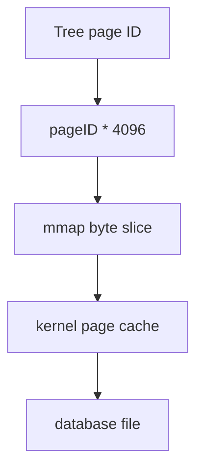

The open path is careful about existing file size, locks, mapping mode, reader
table setup, kernel advice, and metadata recovery.

Code to read:

- mmap constants and metadata page count: [`pagebtree/mmap.go#L32-L53`](../pagebtree/mmap.go#L32-L53)
- mmap options and arena state: [`pagebtree/mmap.go#L55-L79`](../pagebtree/mmap.go#L55-L79)
- Writable open: [`pagebtree/mmap.go#L92-L198`](../pagebtree/mmap.go#L92-L198)
- Read-only open with `PROT_READ`: [`pagebtree/mmap.go#L200-L275`](../pagebtree/mmap.go#L200-L275)
- Page ID to byte slice: [`pagebtree/mmap.go#L297-L303`](../pagebtree/mmap.go#L297-L303)

## Module 9: Dirty Pages, msync, and Metadata Publication

Durability is about publication order. The engine should not publish metadata
that points to data pages before those data pages are flushed. The project uses
an explicit `Sync` boundary:

1. Build any needed freelist/reclaim metadata pages.
2. Sync dirty data pages.
3. Write the alternating metadata page.
4. Sync the metadata page.

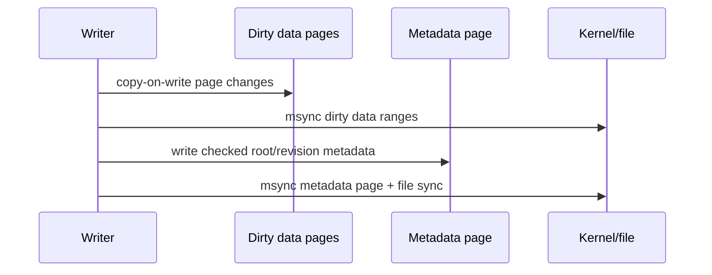

The dirty-page tracker is page-ID based. It sorts dirty page IDs and coalesces
adjacent runs before syncing.

Read-write transaction `Commit` uses the same copy-on-write batch publication
path as direct writes, but it is still a logical publish. The mmap durability
boundary remains `Sync`. `TestMmapTxSyncProcessCrashMatrixClassifiesRecoveryRoot`
commits a transaction, kills a child writer during the following `Sync`, and
then reopens the same file from the parent process. A crash before dirty data
sync recovers the old root. A crash after metadata bytes are written recovers
the new root.

`WriteBatch.CommitSync` and `ReadWriteTx.CommitSync` are the ergonomic durable
commit helpers: they commit, then call `Sync` only when the commit changed the
tree. Their `CommitSyncDetailed` variants return the same per-operation
`BatchCommitResult` as `CommitDetailed`. If the sync step fails, the result
still describes the logical commit visible in the current process, but the
returned error means durable publication is not proven. That is intentionally
explicit; it avoids pretending that a failed `msync` can be hidden behind a
boolean commit result. The mmap fault tests also prove the retry path for both
batches and read-write transactions: after forced failures before dirty data
sync, after metadata bytes are written, and before metadata sync, clearing the
fault and calling `Sync` again publishes the already-visible commit durably
enough to survive close/reopen.

`Stats.Revision` is the current logical root revision. `Stats.SyncedRevision`
is the last revision for which `Sync` returned successfully. After an unsynced
write, `Revision` can be ahead of `SyncedRevision`. After a successful `Sync`,
or after reopening a valid mmap metadata page, they match again. That counter is
small, but it is useful teaching instrumentation because it makes "visible in
this process" and "published through the mmap sync protocol" observable.

`MmapOptions.TraceHook` can observe this path without parsing logs. A traced
sync emits `mmap-sync-begin`, one `mmap-sync-data-range` event per coalesced
dirty data-page run, `mmap-sync-data-synced`, `mmap-sync-meta-published`, and
`mmap-sync-end`. If the sync path fails, it emits `mmap-sync-failed` with the
error text in `Reason` and does not emit `mmap-sync-end`. Phase events carry the
revision, root page, `nextPage`, dirty count, free count, retired count, and
mapped capacity as structured fields. Range events also carry the half-open
`StartPage`/`EndPage` page-id interval that was successfully passed through
`msync`, plus `DurationNanos` for that range flush.

Code to read:

- `Tree.Sync` chooses mmap sync: [`pagebtree/tree.go#L256-L267`](../pagebtree/tree.go#L256-L267)
- mmap sync order and trace phases: [`pagebtree/mmap.go#L1287-L1309`](../pagebtree/mmap.go#L1287-L1309)
- Dirty data-page sync: [`pagebtree/mmap.go#L540-L588`](../pagebtree/mmap.go#L540-L588)
- Per-range `msync`: [`pagebtree/mmap.go#L602-L613`](../pagebtree/mmap.go#L602-L613)
- Metadata page sync: [`pagebtree/mmap.go#L617-L635`](../pagebtree/mmap.go#L617-L635)
- Trace event API and JSON field schema: [`pagebtree/mmap_trace.go#L3-L109`](../pagebtree/mmap_trace.go#L3-L109)
- Transaction process-crash sync proof: [`pagebtree/mmap_process_crash_test.go#L57-L91`](../pagebtree/mmap_process_crash_test.go#L57-L91)
- Batch commit-sync API and sync-error contract: [`pagebtree/batch.go#L130-L220`](../pagebtree/batch.go#L130-L220)
- Transaction commit-sync API: [`pagebtree/tx.go#L144-L185`](../pagebtree/tx.go#L144-L185)
- Commit-sync retry tests: [`pagebtree/commit_sync_mmap_unix_test.go#L128-L358`](../pagebtree/commit_sync_mmap_unix_test.go#L128-L358)
- Synced revision stats tests: [`pagebtree/commit_sync_mmap_unix_test.go#L134-L170`](../pagebtree/commit_sync_mmap_unix_test.go#L134-L170)

## Module 10: Dual Checked Metadata Pages

The mmap file has two checked metadata pages. Revisions alternate between them:

```text
metadata slot = revision % 2
```

On recovery, the engine reads both metadata pages, validates checksums and
format fields, sorts candidates newest-first, and accepts the first candidate
whose root, reachable pages, freelist, reclaim records, leaf links, and logical
key count all validate.

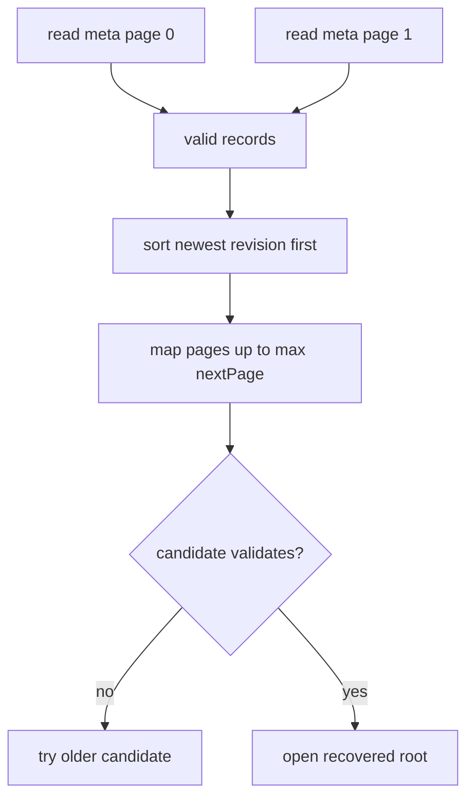

This is the core crash-recovery idea in miniature: a torn newest root can be
rejected, while an older valid root remains usable.

The trace hook also makes this recovery choice visible. Candidate rejection
events include the metadata slot, trusted revision when available, and a reason
string from the validation layer. Acceptance events identify the root that will
serve reads.

Code to read:

- Recovery scan and newest-first sort: [`pagebtree/mmap.go#L937-L983`](../pagebtree/mmap.go#L937-L983)
- Candidate mapping and validation: [`pagebtree/mmap.go#L987-L1051`](../pagebtree/mmap.go#L987-L1051)
- Metadata slot/revision check: [`pagebtree/mmap.go#L1059-L1063`](../pagebtree/mmap.go#L1059-L1063)
- Metadata write format and checksum: [`pagebtree/mmap.go#L1607-L1654`](../pagebtree/mmap.go#L1607-L1654)
- Metadata checksum computation: [`pagebtree/mmap.go#L1657-L1662`](../pagebtree/mmap.go#L1657-L1662)
- Recovery trace tests: [`pagebtree/mmap_test.go#L3416-L3460`](../pagebtree/mmap_test.go#L3416-L3460)

## Module 11: Checksums, Layout Checks, and Invariants

A checksum only proves the bytes match the stored checksum. It does not prove
the bytes describe a valid tree. This project layers validation:

- Page checksum.
- Page layout.
- Overflow-chain invariants.
- Branch-routing invariants.
- Freelist and retired-page invariants.
- Metadata bounds and logical key-count invariants.

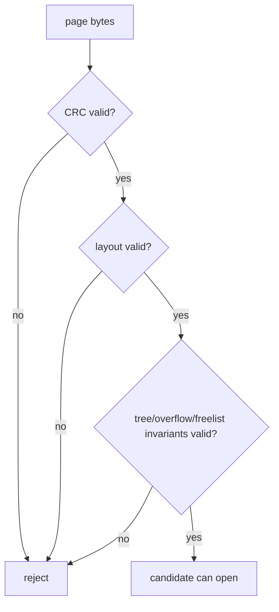

This distinction matters for real storage engines. A corrupt page can have a
fresh checksum if the corruption was written through the engine or a test
rewrote the checksum. Layout and semantic checks catch a different class of
failure.

`Tree.Check` is the strict pass/fail surface. `Tree.Audit` runs the same
validation path but returns an `AuditReport`: current `Stats`, sorted reachable
page IDs, sorted free and retired page IDs, persisted freelist/reclaim metadata
page IDs, value-free page summaries with role/kind/occupancy/routing hints,
whether leaf-link validation ran or was skipped because active readers can
legitimately delay relinking, and the exact validation error. That makes
corruption tests and crash-image experiments
explainable without weakening the validator.

Code to read:

- Integrity checker and audit report: [`pagebtree/integrity.go`](../pagebtree/integrity.go)
- Page checksum: [`pagebtree/page.go#L132-L149`](../pagebtree/page.go#L132-L149)
- Page kind dispatch: [`pagebtree/page.go#L155-L173`](../pagebtree/page.go#L155-L173)
- Slotted layout checks: [`pagebtree/page.go#L175-L225`](../pagebtree/page.go#L175-L225)
- Freelist validation: [`pagebtree/mmap.go#L1664-L1684`](../pagebtree/mmap.go#L1664-L1684)
- Retired-page validation: [`pagebtree/mmap.go#L1686-L1713`](../pagebtree/mmap.go#L1686-L1713)
- Metadata invariant check: [`pagebtree/mmap.go#L1715-L1730`](../pagebtree/mmap.go#L1715-L1730)
- Audit report tests: [`pagebtree/tree_test.go`](../pagebtree/tree_test.go), [`pagebtree/mmap_test.go`](../pagebtree/mmap_test.go)

## Module 12: Freelists, Retired Pages, and Recycling

Copy-on-write creates old pages. Those pages cannot be reused immediately if an
old reader can still reach them. The engine therefore separates pages into:

- Reachable pages: visible from the current root.
- Retired pages: no longer current, but still possibly visible to old readers.
- Free pages: safe to reuse.


This is why deleting half the keys does not necessarily shrink the database
file. Many pages become reusable inside the file, but the logical file length
shrinks only when tail compaction can trim a contiguous free suffix. Interior
free pages are reusable by the engine. On supported filesystems, they may also
become sparse holes, but their page IDs still remain inside the file's logical
range.

There are two different compaction ideas in the repository:

- In-place tail compaction: `Tree.Compact()` can shrink only free pages at the
  physical end of the file. It preserves page IDs and therefore does not need to
  rewrite branch child pointers.
- Offline copy compaction: `CopyCompactMmap(src, dst, options)` opens the source
  read-only, walks live records in sorted order, writes them into a new mmap
  tree, validates the result, and trims the destination. This can reclaim
  interior free pages because the replacement file receives a fresh page-ID
  layout.
- Guarded offline replacement: `CompactMmapFile(path, options)` takes the
  source writer mutex, builds a compact temporary copy, rejects the final swap
  while active mmap readers hold shared file locks, then renames the compact
  file over the source. It is still not online vacuum because it refuses active
  readers and writers instead of relocating pages underneath them.
- Sparse-hole punching: `Tree.PunchFreeMmapPages()` preserves page IDs and file
  length, skips pages reachable from any valid fallback metadata root, then asks
  supported filesystems to deallocate physical blocks for coalesced free-page
  extents.

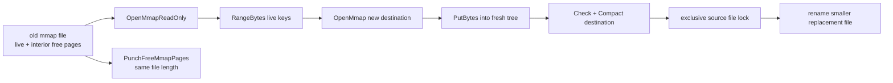

Code to read:

- Free list and retired-page fields: [`pagebtree/tree.go#L12-L17`](../pagebtree/tree.go#L12-L17)
- Allocation reuses free pages first: [`pagebtree/tree.go#L201-L218`](../pagebtree/tree.go#L201-L218)
- Compaction refuses active readers and trims only safe tail pages: [`pagebtree/tree.go#L257-L275`](../pagebtree/tree.go#L257-L275)
- Tail compaction mechanics: [`pagebtree/mmap.go#L408-L482`](../pagebtree/mmap.go#L408-L482)
- Offline copy-compaction API: [`pagebtree/copy_compact.go#L23-L104`](../pagebtree/copy_compact.go#L23-L104)
- Guarded replacement API: [`pagebtree/compact_replace_unix.go#L12-L70`](../pagebtree/compact_replace_unix.go#L12-L70)
- Sparse-hole safety filter: [`pagebtree/mmap_punch_unix.go#L7-L80`](../pagebtree/mmap_punch_unix.go#L7-L80)
- Linux hole-punch primitive: [`pagebtree/mmap_punch_linux.go#L10-L27`](../pagebtree/mmap_punch_linux.go#L10-L27)
- Copy-compaction command: [`cmd/mmapcopycompact/main.go#L10-L25`](../cmd/mmapcopycompact/main.go#L10-L25)
- Compact-replacement command: [`cmd/mmapcompact/main.go#L10-L25`](../cmd/mmapcompact/main.go#L10-L25)
- Copy-compaction behavior tests: [`pagebtree/mmap_test.go#L1993-L2086`](../pagebtree/mmap_test.go#L1993-L2086)
- Compact-replacement behavior tests: [`pagebtree/mmap_test.go#L2088-L2196`](../pagebtree/mmap_test.go#L2088-L2196)
- Persisted reclaim recovery: [`pagebtree/mmap.go#L1099-L1151`](../pagebtree/mmap.go#L1099-L1151)

## Module 13: Reader Tables and MVCC Watermarks

An in-process snapshot is easy: the tree remembers an active reader revision.
A read-only mmap process is harder because it may be in another process. This
project uses a sidecar `.readers` file as a small LMDB-style reader table.

A read-only handle claims a slot at revision `0` before metadata recovery. That
provisional zero revision is a conservative pin: while the reader is between
"I opened the file" and "I recovered the root revision", writers must not trust
that old pages are reusable. After recovery, the reader updates the slot to the
actual recovered revision.

Version-3 reader slots record PID, revision, claim token, a process-start token,
and a boot/session token when the platform exposes them. Linux reads process
start from `/proc/<pid>/stat` and boot identity from
`/proc/sys/kernel/random/boot_id`; Darwin reads process start from
`kern.proc.pid` and boot identity from `kern.boottime`. These extra tokens reduce
the classic PID reuse problem and the reboot/session ambiguity around stale
sidecars: a cleanup scan can treat a live PID as stale when the stored owner
tokens no longer match the process and boot now using that PID. Version-1 and
version-2 sidecars remain readable as older, weaker slot formats.

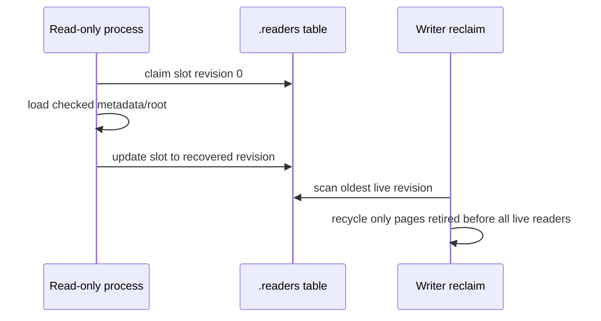

The table is fail-closed. A malformed active slot with a future revision or a
zero claim token returns `ErrReaderTable`. Writer reclaim then conservatively
keeps retired pages pinned instead of recycling from an untrusted watermark.
`Stats.ReclaimPressure` exposes that same decision surface: total retired
pages, how many are pinned by the oldest reader watermark, how many would be
reclaimable at the current watermark, the oldest reader revision when known,
and whether a reader-table scan failure forced the conservative pin.
`InspectMmapReaderStats(path)` is the passive inspection path: it recovers the
same usable root revision that normal metadata recovery would accept, opens an
existing `.readers` sidecar without creating it, and scans slots without
claiming one for itself. That is the API `cmd/mmapinspect --readers` uses after
closing its own read-only handle, so the act of observing reader pressure does
not add an extra reader watermark. If the newest checked metadata points at a
torn root and recovery falls back to the older root, passive reader inspection
validates slots against the older recovered revision too.

Code to read:

- Reader table file shape: [`pagebtree/reader_table_unix.go#L17-L40`](../pagebtree/reader_table_unix.go#L17-L40)
- Claim a reader slot: [`pagebtree/reader_table_unix.go#L74-L109`](../pagebtree/reader_table_unix.go#L74-L109)
- Read-only pre-load claim and post-load update: [`pagebtree/mmap.go#L245-L273`](../pagebtree/mmap.go#L245-L273)
- Oldest reader scan and stale owner cleanup: [`pagebtree/reader_table_unix.go#L149-L180`](../pagebtree/reader_table_unix.go#L149-L180)
- Stats and maintenance scan: [`pagebtree/reader_table_unix.go#L205-L242`](../pagebtree/reader_table_unix.go#L205-L242)
- Fail-closed slot validation: [`pagebtree/reader_table_unix.go#L244-L252`](../pagebtree/reader_table_unix.go#L244-L252)
- Passive reader-table inspection: [`pagebtree/reader_table_unix.go`](../pagebtree/reader_table_unix.go)

## Module 14: Kernel Page Cache, mmap Advice, and Prefetch

With mmap, the kernel is the raw page cache. The engine can still cooperate with
the kernel by giving access-pattern hints:

- Random access for B+tree lookups, to avoid aggressive sequential readahead.
- Sequential or will-need hints for scan experiments.
- Dont-need hints for explicit clean-page cache drop experiments.
- Exact next-leaf prefetch hints during linked-leaf range scans.

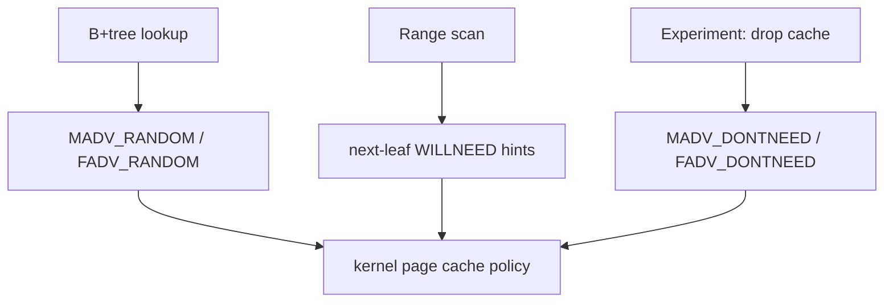

The important design choice is restraint. The project does not try to outguess
the kernel with a second raw page cache. It adds only a bounded derived routing
cache for decoded branch separator arrays. The mapped bytes remain the source of
truth.

Code to read:

- mmap access-pattern enum: [`pagebtree/mmap.go#L81-L90`](../pagebtree/mmap.go#L81-L90)
- Range scan prefetcher: [`pagebtree/tree.go#L135-L167`](../pagebtree/tree.go#L135-L167)
- Linked-leaf range prefetch calls: [`pagebtree/search.go#L97-L180`](../pagebtree/search.go#L97-L180)
- Derived branch-routing cache: [`pagebtree/page_cache.go#L5-L33`](../pagebtree/page_cache.go#L5-L33)
- Cache lookup by page checksum: [`pagebtree/page_cache.go#L52-L80`](../pagebtree/page_cache.go#L52-L80)
- Profile byte-policy flags: [`pagebtree/kernel_profile.go#L29-L36`](../pagebtree/kernel_profile.go#L29-L36)
- Profile flags for kernel cache vs heap cache: [`pagebtree/kernel_profile.go#L104-L113`](../pagebtree/kernel_profile.go#L104-L113)

## Module 15: Observability Without Hiding the Engine

Storage-engine observability has several layers:

- Counters: `Stats`, `MmapReaderStats`, `MmapCacheStats`, and `MmapSpaceStats`
  tell you current quantities. `Stats` includes reachable leaf/branch/overflow
  page counts, total reachable page capacity/free bytes, and
  leaf/branch/overflow used-byte buckets. It also includes reclaim-pressure
  counters that separate reader-pinned retired pages from immediately
  reclaimable retired pages. `MmapCacheStats` observes residency in the kernel
  page cache; `MmapSpaceStats` observes logical file bytes versus
  filesystem-reported allocated bytes plus filesystem and mount identity where
  available for sparse-file experiments.
- Validation reports: `Audit` tells you what the validator actually reached:
  reachable page IDs, reusable page IDs, retired page IDs, linked-leaf check
  state, and the same error that `Check` would return.
- Profiles: `MDBKernelProfile` tells you which design mechanics are active,
  including mmap/kernel-cache mechanics and the byte-balance policy used by
  split, delete redistribution, merge, and repair decisions.
  `MmapHolePunchProfile` reports the platform-level sparse-hole primitive or
  unsupported reason for this build.
- Trace events: `MmapOptions.TraceHook` tells you which path the engine took.

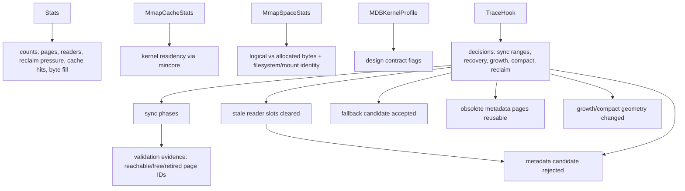

This matters because a serious engine should explain decisions, not only final
state. If `OpenMmap` accepts an older metadata page after rejecting the newest
candidate, a trace hook can show the rejected revision, metadata slot, and
validation reason. If `Sync` stalls in a larger experiment, the phase events let
you separate "dirty data pages flushed" from "metadata published"; if it fails,
`mmap-sync-failed` carries the returned error reason and `mmap-sync-end` is
absent. If old freelist/reclaim metadata pages become reusable only after both
alternating metadata slots move past them, the reclaim trace event marks that
decision. If freshly prepared freelist or reclaim metadata pages are rolled
back after a later sync or metadata-publish error, rollback trace events report
the metadata-page count, page-id span, and returned error. Growth and compaction
events carry old/new mapped capacity, old/new `nextPage`, and resulting file
size; their failure events also carry the returned error reason, so a failed
remap is visible without parsing logs. Dirty sync range events carry
`StartPage`, `EndPage`, and `DurationNanos`, so slow write stalls can be tied
back to concrete page-id intervals. Sparse-hole punch events report skipped
fallback-recoverable pages, every punched half-open page range, aggregate
punched pages and bytes, and the attempted range plus error reason on failure.
Reader cleanup events report how many dead or detectably reused owner slots were
cleared from the sidecar reader table.

The hook is synchronous and should stay lightweight. In a real product you
can start with `NewMmapTraceJSONLExporter`, which writes one lower-snake-field
JSON object per line and keeps the first write error for later inspection
through `Err()`. That is intentionally small: it makes the kernel visible during
tests and demos without putting a logging framework in the storage core.
The trace schema is intentionally value-free: it reports page IDs, revisions,
counts, ranges, durations, slots, and failure reasons, but it does not include
application keys or values. If an embedding application adds its own trace
fields around this hook, redact at that application boundary before export.
If exporting itself may block the write path, use `NewMmapTraceAsyncJSONLExporter`
with a bounded queue. It drains JSONL from a background goroutine, `Close`
flushes queued events and returns the first encode/write error, and `Dropped`
reports events skipped because the queue was full or already closed. That makes
trace pressure visible instead of hiding stalls inside the storage hook.

```go
exporter := pagebtree.NewMmapTraceJSONLExporter(os.Stdout)
tree, _ := pagebtree.OpenMmap("trace.db", pagebtree.MmapOptions{
    TraceHook: exporter.Hook(),
})
// mutate, Sync, Close...
if err := exporter.Err(); err != nil {
    // exporting failed
}
```

```go
async := pagebtree.NewMmapTraceAsyncJSONLExporter(os.Stdout, 1024)
tree, _ := pagebtree.OpenMmap("trace.db", pagebtree.MmapOptions{
    TraceHook: async.Hook(),
})
// mutate, Sync, Close...
if err := async.Close(); err != nil {
    // exporting failed
}
if async.Dropped() > 0 {
    // trace queue was too small for the workload
}
```

The runnable command version emits JSONL only on stdout. It performs a small
write/delete/compact workload, so the output includes ordinary sync events plus
growth and compaction geometry:

```bash
go run ./cmd/mmaptrace-demo > mmap-trace.jsonl
go run ./cmd/mmaptracesummary mmap-trace.jsonl > mmap-trace-summary.md
```

`cmd/mmaptracesummary` is the standalone trace-review path. It reads value-free
trace JSONL from files or stdin, prints Markdown event-kind counts, dirty-range
and sparse-punch aggregates, failure reasons, and a bounded ordered timeline.
Use `--limit N` to keep long workloads readable while still counting all events.

For an operator-style read-only validation snapshot, `cmd/mmapinspect` opens an
mmap database through `OpenMmapReadOnly`, runs `Audit`, and writes indented JSON
with validity, stats, persisted key-order identity, comparator kind, readable
names for both, reachable page IDs, free page IDs, retired page IDs, metadata
page IDs, linked-leaf validation state, and `metadata_recovery` candidate
events showing which checked metadata records were accepted or rejected during
the same recovery path normal open uses. If normal read-only open fails, the
command still emits an invalid JSON report with the open error and any recovery
candidate events collected before failure, so broken images can be diagnosed
without scraping stderr. When `--readers` is present on that failed-open path,
the report also includes either passive `reader_stats` or `reader_stats_error`,
so a malformed `.readers` sidecar is visible next to metadata recovery state.
`--locks` adds passive writer-sidecar evidence through `InspectMmapLockStats`:
whether the `.writer` mutex file exists and whether a non-blocking exclusive
lock attempt observed active writer contention. On failed-open reports it uses
the same `lock_stats` or `lock_stats_error` shape, so lock contention can be
seen beside metadata and reader-table failures. `--readers` closes that
inspection handle first, then uses
`InspectMmapReaderStats` to add the mmap reader-table slot summary without
claiming an inspector slot. `--cache` adds kernel page-cache residency counts,
and `--space` adds logical-vs-allocated file-space counts plus the hole-punch
capability profile. `--pages` adds value-free page summaries with role, kind,
byte occupancy, branch children, metadata record counts, reclaim revision
bounds, and next-page hints. Reclaim-pressure counters are included in the base
`Stats` block so a reader-pinned freelist stall is visible without dumping
values. `--keys N` adds a bounded first/last key sample in the recovered
comparator order without dumping values. `--trace TRACE.jsonl` reads value-free
trace JSONL, counts events by kind, summarizes dirty data-page ranges,
summarizes sparse-hole
punched ranges/pages/bytes and skipped fallback-recoverable pages, records the
last traced revision/root/nextPage/maxPages geometry, reports trace failure
reasons, and checks whether the last traced revision/root/nextPage matches the
inspected database:

```bash
go run ./cmd/mmapinspect --readers --locks --cache --space --pages --keys=4 --trace mmap-trace.jsonl /path/to/source.db
```

For filesystem-specific sparse allocation experiments, `cmd/mmapfsprobe` creates
a disposable database on the target path and records insert, delete, compact,
and sparse-punch phases as value-free JSON. `cmd/fsprobesummary` turns one or
more saved probe reports into a stable Markdown comparison table:

```bash
go run ./cmd/mmapfsprobe --keys 256 --value-bytes 512 --label local-fs --redact-path /path/to/probe.db > probe.json
go run ./cmd/fsprobesummary probe.json > probe-summary.md
```

Code to read:

- Stats byte-fill fields and reachable-page walk: [`pagebtree/stats.go#L3-L170`](../pagebtree/stats.go#L3-L170)
- Stats byte-fill tests: [`pagebtree/tree_test.go#L78-L117`](../pagebtree/tree_test.go#L78-L117), [`pagebtree/mmap_test.go#L53-L93`](../pagebtree/mmap_test.go#L53-L93)
- Audit report API and checker delegation: [`pagebtree/integrity.go`](../pagebtree/integrity.go)
- Audit report tests: [`pagebtree/tree_test.go`](../pagebtree/tree_test.go), [`pagebtree/mmap_test.go`](../pagebtree/mmap_test.go)
- Audit inspect command: [`cmd/mmapinspect/main.go`](../cmd/mmapinspect/main.go)
- Audit inspect command tests: [`cmd/mmapinspect/main_test.go`](../cmd/mmapinspect/main_test.go)
- Mmap space stats API: [`pagebtree/mmap_space.go`](../pagebtree/mmap_space.go), [`pagebtree/mmap_space_unix.go`](../pagebtree/mmap_space_unix.go)
- Filesystem probe and summary commands: [`cmd/mmapfsprobe/main.go`](../cmd/mmapfsprobe/main.go), [`cmd/fsprobesummary/main.go`](../cmd/fsprobesummary/main.go)
- Trace event API and JSON field schema: [`pagebtree/mmap_trace.go#L3-L109`](../pagebtree/mmap_trace.go#L3-L109)
- JSONL exporters: [`pagebtree/mmap_trace_export.go`](../pagebtree/mmap_trace_export.go)
- JSONL exporter example: [`pagebtree/example_test.go#L137-L157`](../pagebtree/example_test.go#L137-L157)
- JSONL trace demo command: [`cmd/mmaptrace-demo/main.go`](../cmd/mmaptrace-demo/main.go)
- JSONL trace summary command: [`cmd/mmaptracesummary/main.go`](../cmd/mmaptracesummary/main.go)
- Hook option on mmap open: [`pagebtree/mmap.go#L56-L64`](../pagebtree/mmap.go#L56-L64)
- Sync trace emissions: [`pagebtree/mmap.go#L1287-L1309`](../pagebtree/mmap.go#L1287-L1309)
- Recovery trace emissions: [`pagebtree/mmap.go#L937-L1051`](../pagebtree/mmap.go#L937-L1051)
- Freelist/reclaim rollback trace emission: [`pagebtree/mmap_trace_unix.go#L22-L44`](../pagebtree/mmap_trace_unix.go#L22-L44)
- Obsolete metadata-page reclaim trace emission: [`pagebtree/mmap.go#L1460-L1488`](../pagebtree/mmap.go#L1460-L1488)
- Growth trace emissions: [`pagebtree/mmap.go#L346-L411`](../pagebtree/mmap.go#L346-L411)
- Compact trace emissions: [`pagebtree/mmap.go#L426-L505`](../pagebtree/mmap.go#L426-L505)
- Reader cleanup trace emission: [`pagebtree/reader_table_unix.go#L262-L272`](../pagebtree/reader_table_unix.go#L262-L272)
- Sparse-hole trace emissions: [`pagebtree/mmap_punch_unix.go`](../pagebtree/mmap_punch_unix.go), [`pagebtree/mmap_trace_unix.go`](../pagebtree/mmap_trace_unix.go)
- Reclaim and rollback trace tests: [`pagebtree/mmap_test.go#L2962-L3163`](../pagebtree/mmap_test.go#L2962-L3163)
- Growth and compact trace tests: [`pagebtree/mmap_test.go#L3165-L3382`](../pagebtree/mmap_test.go#L3165-L3382)
- Sync and recovery trace tests: [`pagebtree/mmap_test.go#L3712-L3911`](../pagebtree/mmap_test.go#L3712-L3911)
- Reader cleanup trace test: [`pagebtree/mmap_test.go#L5132-L5183`](../pagebtree/mmap_test.go#L5132-L5183)
- Sparse-hole trace tests: [`pagebtree/mmap_test.go`](../pagebtree/mmap_test.go)

## Module 16: OpenLDAP/LMDB Versus OpenDJ/Berkeley JE

OpenLDAP MDB/LMDB is the reference style for this repository:

- Memory-map the database file.
- Use copy-on-write B+tree pages.
- Publish roots through checked metadata pages.
- Allow many lock-free readers.
- Serialize writers.
- Recycle old pages only after reader watermarks allow it.
- Let the operating system page cache own raw database-page caching.

OpenDJ's Berkeley DB Java Edition lineage is a useful contrast:

- The primary persistence shape is append-only log files.
- B+tree nodes are managed through a Java heap cache.
- Background cleaner work reclaims obsolete log records.
- Recovery reconstructs state from logged records rather than selecting a
  checked mapped-file root page.

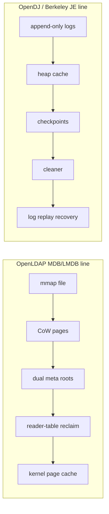

This project implements the core of the first line, not the second. It uses Go
maps as an in-memory page directory around the mapped bytes, and it has a small
derived branch-routing cache, but it intentionally does not build a Java-style
raw page cache or append-only log cleaner.

Code to read:

- OpenLDAP-style profile fields: [`pagebtree/kernel_profile.go#L28-L45`](../pagebtree/kernel_profile.go#L28-L45)
- mmap open and reader table: [`pagebtree/mmap.go#L107-L198`](../pagebtree/mmap.go#L107-L198)
- Read-only mmap handle: [`pagebtree/mmap.go#L200-L275`](../pagebtree/mmap.go#L200-L275)
- Metadata root recovery instead of log replay: [`pagebtree/mmap.go#L937-L1051`](../pagebtree/mmap.go#L937-L1051)
- Bounded derived routing cache, not raw heap page cache: [`pagebtree/page_cache.go#L35-L80`](../pagebtree/page_cache.go#L35-L80)

## Module 17: What Is Serious Here, and What Is Still Research

Serious pieces in this repository:

- Real fixed-size slotted pages.
- String-key and opaque byte-key APIs ordered by named page-key comparators.
- A memory-backed `KeyComparator` boundary used by search, ranges, cursors,
  transactions, validation, and derived branch-routing cache lookups.
- mmap metadata that persists named key-order identities, currently bytewise and
  reverse bytewise, and rejects unsupported ordering semantics or non-persisted
  custom comparators on reopen.
- Direct slot binary search for point lookup.
- Branch child page IDs stored in page bytes.
- Copy-on-write root publication.
- Stable snapshots and external read-only mmap handles.
- Reader-pinned page recycling.
- Persisted reclaim records.
- Dual checked metadata pages.
- mmap-backed persistence with dirty-page sync.
- Overflow page chains.
- Layout and invariant validation.
- Kernel page-cache hints and cache-residency stats.
- Bounded derived branch-routing cache.
- Optional structured mmap trace events for sync phases and failures, recovery
  fallback, growth and compact remap success/failure geometry, stale reader
  cleanup, freelist/reclaim metadata rollback, and obsolete metadata-page
  reclaim decisions.
- Explicit write batches that publish one revision, support point mutations and
  half-open range deletes, and can report per-operation old values through
  `CommitDetailed`.
- A small read-write transaction facade with stable begin-revision reads,
  read-your-writes point reads, `RangeBetween` over the staged view,
  transaction-visible range delete expansion, transaction cursors with staged
  `Delete`, rollback, optimistic revision-conflict detection, and one-revision
  commit through the batch machinery. Batches and read-write transactions also
  expose `CommitSync`/`CommitSyncDetailed` helpers that commit and then call
  `Sync` when the commit changed the tree.
- A sorted-map model/fuzz target for put, delete, cursor delete, batch, batch
  range delete, read-write transaction, transaction cursor delete, range,
  cursor, bounded cursor, reverse bounded cursor, and integrity-check operation
  streams.
- An mmap sorted-map model/fuzz target that injects sync/close/reopen cycles,
  batch range deletes, read-write transactions, transaction cursor deletes, and
  overflow-heavy values.
- A malformed mmap-image fuzz target that mutates metadata, page headers,
  checksums, truncation, and tree/overflow-bearing pages, then requires any
  accepted image to pass `Tree.Check`.
- Process-exit crash probes that kill a child writer at sync-publication,
  transaction-sync-publication, mmap-growth, compact-shrink, large-freelist
  spill, and large-reclaim spill fault points, then reopen the same database
  from a fresh process.
- Reproducible microbenchmarks for page and mmap get, seek/next, forward and
  reverse bounded cursor, bounded range, insert, delete, reopen, and sync paths.
  Run a short local pass with
  `go test ./pagebtree -run '^$' -bench 'Benchmark(PageTree|MmapTree)' -benchmem -benchtime=100x`.
  Capture repeated raw output with `-count=5 > bench.out`, then summarize it
  for review with `go run ./cmd/benchsummary bench.out > bench-summary.md`.

Still research or incomplete compared with a production engine:

- No concurrency-heavy lock manager.
- No full ACID transaction API; write batches exist with detailed commit
  reporting, panic rollback, and half-open range delete, and read-write
  transactions add read-your-writes `Get`, `RangeBetween`, range delete,
  transaction cursor delete, stable begin-revision reads, rollback, optimistic
  revision-conflict detection, one-revision commit, and a process-exit crash
  proof for commit followed by mmap `Sync`. `CommitSync` and
  `CommitSyncDetailed` provide explicit commit-then-sync helpers, but
  concurrency stress and filesystem-specific fsync guarantees remain research
  work.
- Sparse-file hole punching is experimental and Linux-backed; portability,
  physical-allocation measurement, and operational policy remain open.
- No full vacuum that moves live pages.
- No production-grade crash test harness with true power-fail fault injection;
  sync publication, transaction sync publication, mmap growth, compact shrink,
  large-freelist spill, and large-reclaim spill have process-exit probes.
- No arbitrary mmap custom-comparator plugin identity or locale/collation layer
  yet; memory-backed trees can use a custom comparator, while mmap files can
  reopen only named built-in orders persisted in metadata.
- Insertion and delete redistribution use byte-aware split-point selection, and
  leaf/branch repair have configurable low-byte-occupancy triggers at the
  minimum key count; merge decisions check combined page bytes, but fuller
  occupancy-target heuristics are still open.
- No production-grade malformed-page corpus minimization or semantic repair
  oracle yet.
- No benchstat baseline history or CI performance gate yet; the repository has
  a lightweight `cmd/benchsummary` table generator for local baseline notes.
- No production-grade tracing pipeline beyond lightweight sync/async JSONL
  export and read-only inspect correlation.
- No multi-database catalog, duplicate keys, or persisted comparator plugins.
- No portability story beyond the Unix mmap path and non-Unix stubs.

The value is that the core mechanisms are visible. You can read the code without
first reading hundreds of thousands of lines of production database history.

## Module 18: How to Study the Code

Run the behavior contract first:

```bash
go test ./...
go run ./cmd/pagebtree-demo
go run ./cmd/mmapbtree-demo
go run ./cmd/mdbkernel-demo
```

Then follow this path:

1. Read `pagebtree/page.go` until the slotted page layout is clear.
2. Read `pagebtree/search.go` and trace one `Get`.
3. Read `pagebtree/insert.go` and trace one split.
4. Read `pagebtree/tree.go` and identify exactly where root publication happens.
5. Read `pagebtree/mmap.go` from `OpenMmap` through `loadMeta`.
6. Read `pagebtree/reader_table_unix.go` and explain why revision `0` is a pin.
7. Read `pagebtree/mmap_test.go` as the executable crash/recovery/reclaim spec.

Final audit question for yourself: if a page ID is reused, which old readers
could still have reached the old bytes? The whole COW/reclaim system exists to
make that answer safe.
