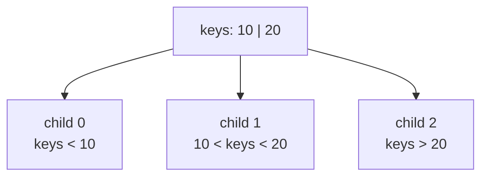
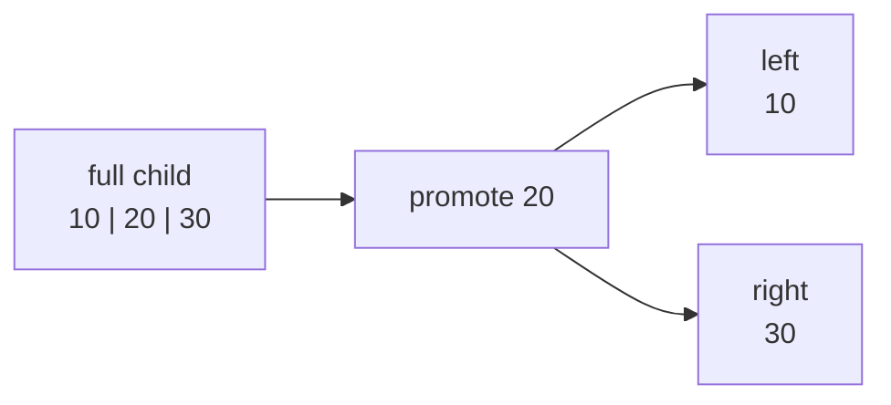

# 01. B-tree Theory

A B-tree is a sorted search tree where each node can hold many keys. This keeps the tree shallow, which is useful when each node maps to an expensive unit such as a disk page, a cache line group, or a remote block.

This repository implements the classic B-tree form:

- Keys and values can live in internal nodes or leaves.
- Each internal node has one more child pointer than key count.
- Keys inside every node are sorted.
- Child ranges are separated by the parent keys.

## Search Invariant

For a node with keys `[10, 20]`, the children cover three ranges:

Search does the same thing at every level:

1. Binary-search the node's key slice.
2. Return the value if the key is present.
3. If it is absent and the node is a leaf, stop.
4. Otherwise descend into the child at the insertion point.

## Degree

The tree uses the standard minimum degree `t`.

| Term | Value |
| --- | --- |
| Minimum degree | `t` |
| Maximum keys per node | `2t - 1` |
| Maximum children per internal node | `2t` |
| Median key during split | index `t - 1` |

The examples often use degree `2` because the diagrams stay small. A production system would choose node capacity from page size, key size, pointer size, and cache behavior.

## Why Splits Work

When a child becomes full, insertion splits it before descending. With degree `2`, a full node has three keys:

The median moves into the parent. Keys smaller than the median stay in the left child. Keys larger than the median move to the right child. This preserves the search invariant.

## What This Project Leaves Out

The first logical `btree` package focuses on insertion and snapshots. The page-backed package later adds an educational copy-on-write delete path, including leaf merge or redistribution when a sibling can absorb or lend records, plus branch merge or redistribution when branch children need to be rebalanced. Full production deletion still has more cases: branch-level borrow and byte-balanced redistribution are separate topics once the core mechanics are clear.
