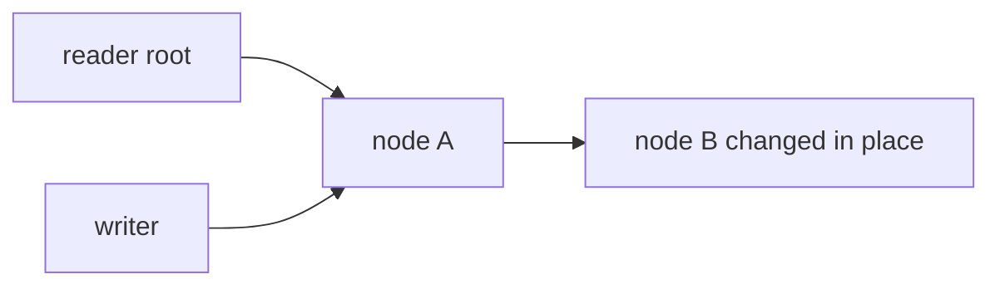
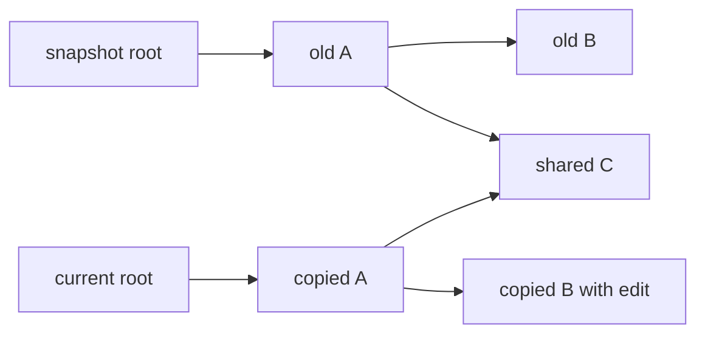
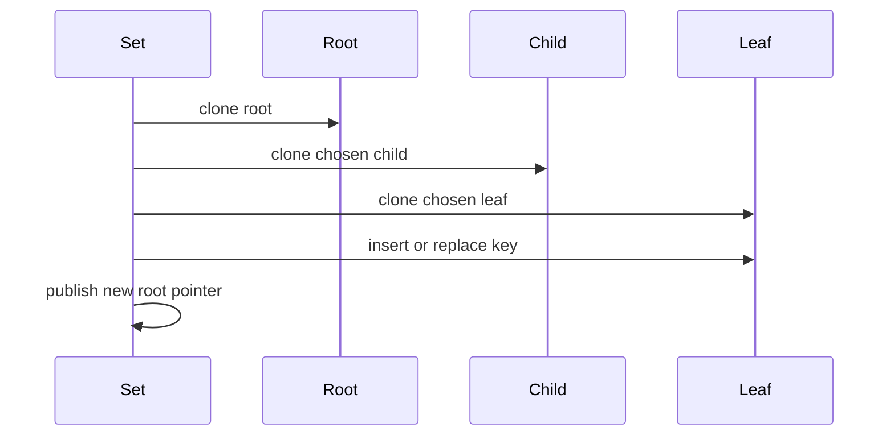

# 02. Copy-on-Write

Copy-on-write means a write does not modify shared structure in place. Instead, it copies the nodes it needs to change, edits the copies, and publishes a new root.

That one rule gives us cheap snapshots.

## Mutable Update vs Copy-on-Write

With ordinary mutation, a reader holding the old root can observe changes:



With copy-on-write, the writer creates a private path:



The old root still points to the old path. Untouched subtrees, such as `C`, remain shared.

## Path Copying

For one key update, only the search path is copied:



This repository uses path copying in `btree/insert.go`:

- `Tree.Set` clones the root.
- `insertNonFull` clones the child before descending.
- `splitChild` edits only nodes that are already private to this write.

## Snapshot Cost

A snapshot is only:

```go
type Snapshot[K cmp.Ordered, V any] struct {
    root     *node[K, V]
    length   int
    revision uint64
    degree   int
}
```

No full tree copy happens when a snapshot is created. The memory cost comes later, when writes keep old nodes alive because snapshots still reference them.

## Trade-offs

Copy-on-write is excellent for:

- Read snapshots.
- Simple concurrency models.
- Crash-safe publish steps in persistent systems.
- Functional or persistent data structures.

It has costs:

- Writes allocate new nodes.
- Old versions keep memory alive until snapshots are released.
- Large values should usually be stored outside the tree to avoid expensive copies.
