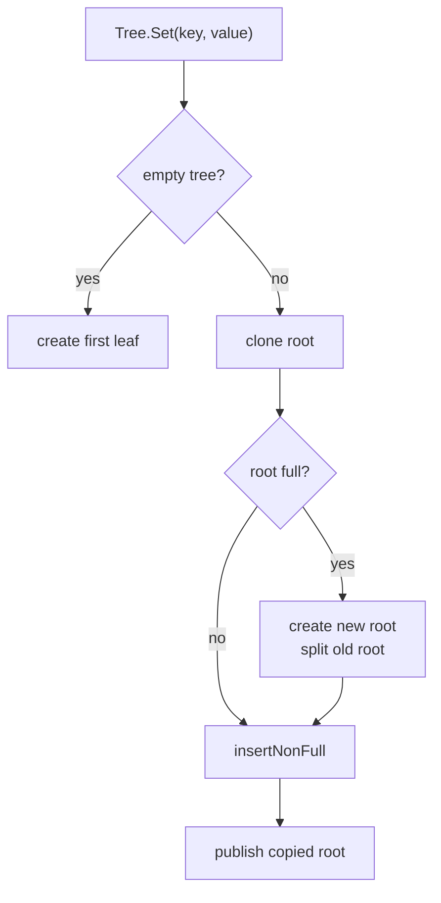
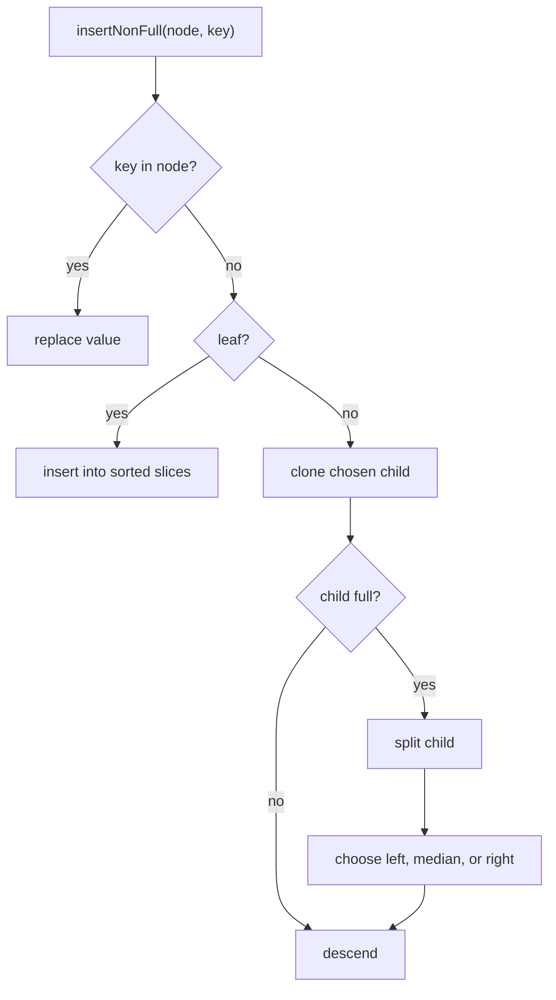
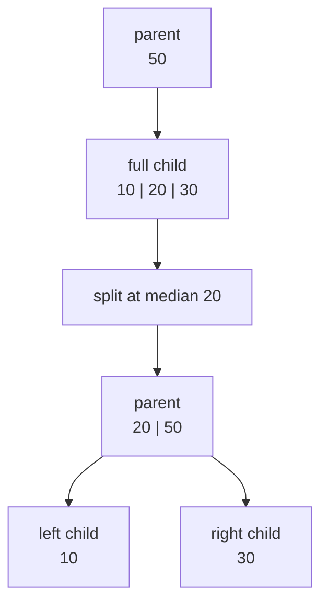
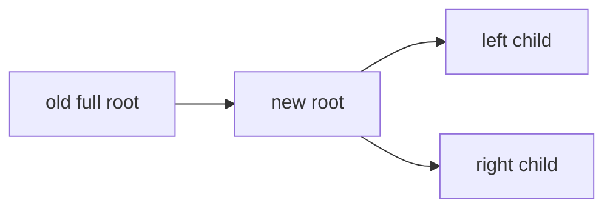

# 03. Insertion Algorithm

Insertion uses top-down splitting. Before descending into a full child, the algorithm splits that child. This guarantees the recursive call always receives a non-full node.

## High-level Flow

## Descending

## Split Example

For degree `2`, maximum keys is `3`.

The code is in `btree/insert.go`:

- `insertNonFull` decides where to go.
- `splitChild` moves the median into the parent.
- `insertAt` keeps keys, values, and children aligned.

## Why Root Splits Are Special

When the root is full, there is no parent to receive the median. The tree creates a new empty root, makes the old root its first child, and splits that child.

This is the only operation that increases tree height.
