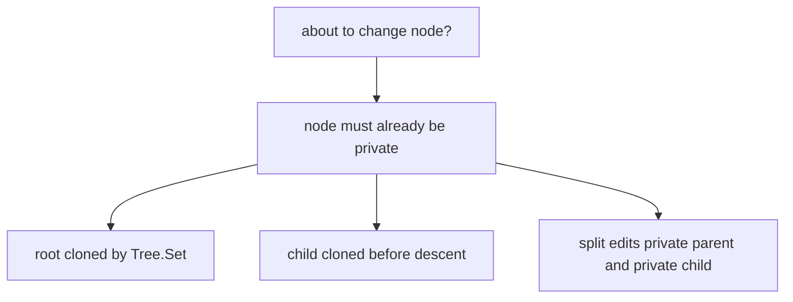

# 04. Code Tour

The package is intentionally split by concept.

## Public API

`btree/tree.go` exposes:

- `New[K, V](degree int)`
- `Set(key, value)`
- `Get(key)`
- `Range(visitor)`
- `Snapshot()`
- `Stats()`

The public type is small:

```go
type Tree[K cmp.Ordered, V any] struct {
    root     *node[K, V]
    length   int
    revision uint64
    degree   int
}
```

The root pointer is the version boundary. Publishing a write means assigning a new root pointer after path-copying edits are complete.

## Node Shape

`btree/node.go` contains the private node type:

```go
type node[K cmp.Ordered, V any] struct {
    leaf     bool
    keys     []K
    values   []V
    children []*node[K, V]
}
```

The implementation stores values next to keys even in internal nodes. This is simpler than a B+tree, where all values live in leaves.

## Search

`btree/search.go` has two read-only traversals:

- `searchNode` for point lookup.
- `rangeNode` for sorted in-order scanning.

Neither function allocates or mutates nodes.

## Writes

`btree/insert.go` contains the copy-on-write mutation logic. The key discipline is simple:



If you add new write operations, keep that discipline. Any helper that mutates a node should document why the node is private.

## Snapshots

`btree/snapshot.go` is deliberately tiny. A snapshot does not clone the tree. It stores the old root pointer and delegates reads to the same search and range helpers as `Tree`.

## Stats

`btree/stats.go` is not needed for the data structure itself. It exists so learners can observe height and node count while experimenting.
