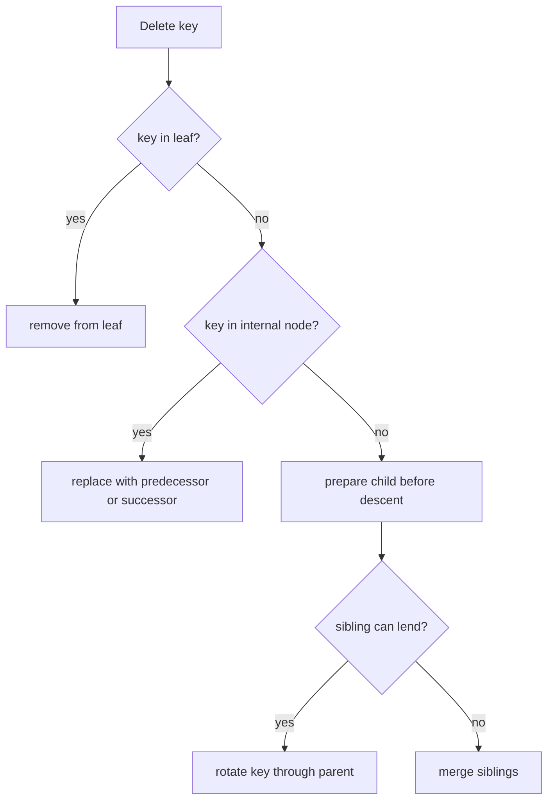
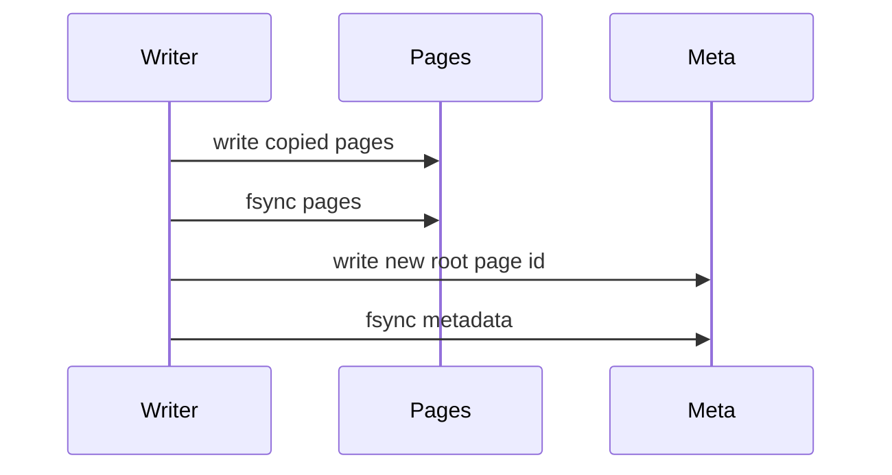

# 05. Exercises

These exercises are ordered from small API work to deeper storage-engine ideas.

## Exercise 1: Add `Min` and `Max`

Add:

```go
func (t *Tree[K, V]) Min() (K, V, bool)
func (t *Tree[K, V]) Max() (K, V, bool)
```

Hints:

- `Min` follows child `0` until it reaches a leaf.
- `Max` follows the last child until it reaches a leaf.
- Add the same methods to `Snapshot`.

## Exercise 2: Add Descending Range

Add `RangeDesc`. It should visit keys in reverse sorted order and stop when the visitor returns `false`.

The reverse of in-order traversal is:

1. Visit right child.
2. Visit key.
3. Visit left child.

## Exercise 3: Implement Delete

Deletion has more cases than insertion. A robust implementation should keep every node on the descent path above the minimum key count before recursing.



Keep the copy-on-write rule: clone any node before changing it.

## Exercise 4: Convert to a B+tree

A B+tree stores all values in leaves and uses internal keys only as separators.

Benefits:

- Range scans are faster if leaves are linked.
- Internal nodes become smaller because they store only keys and child pointers.
- It maps naturally to page-based storage engines.

New challenge: when copy-on-write splits a leaf, updating leaf sibling pointers must not mutate leaves visible to old snapshots.

## Exercise 5: Add Pages

Replace heap nodes with fixed-size pages inspired by database systems.


Questions to answer:

- How large is a page?
- Are keys fixed or variable length?
- How do you encode child pointers?
- How does a copied page receive a new page id?

## Exercise 6: Add Persistence

Persistent copy-on-write trees usually publish a new root through a small metadata record.



This is the bridge from an in-memory teaching tree to storage engines such as LMDB-style designs.
