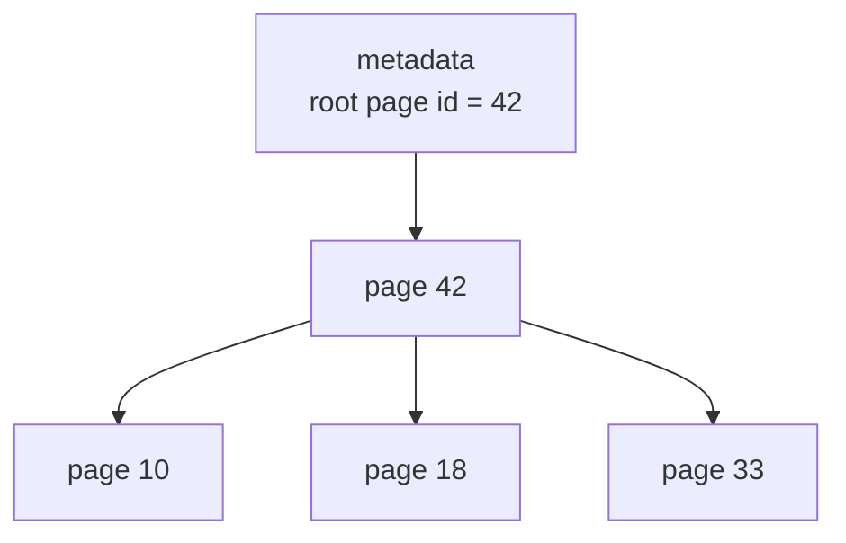
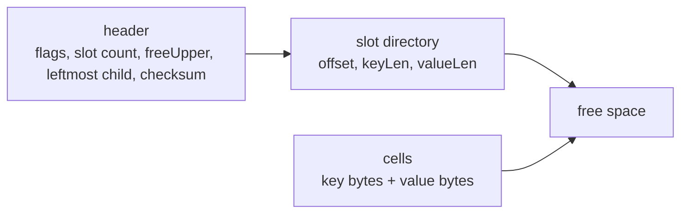
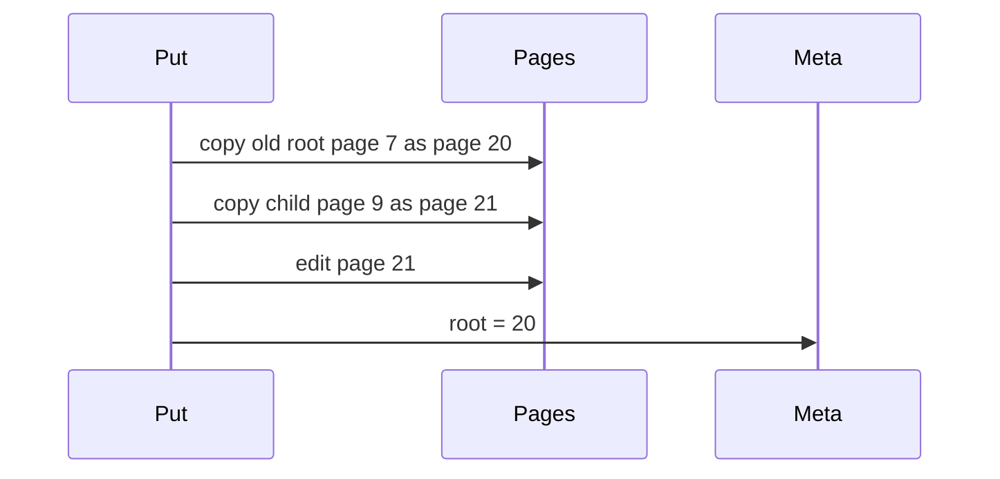
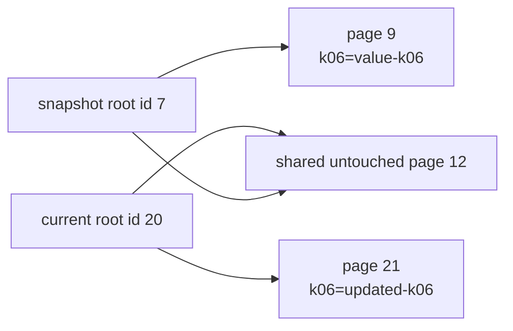

# 06. Page-backed Copy-on-Write Tree

The first package, `btree`, teaches the logical B-tree algorithm. The second package, `pagebtree`, makes the storage-engine idea more explicit: nodes are fixed-size slotted pages, pages have stable ids, writes allocate copied pages, and the current tree is published by changing the root page id.

## Why Add Pages?

Production B-trees usually do not point directly to heap objects. They point to pages.



This package still stores pages in memory, but the important boundary is now visible:

```go
type Tree struct {
    pages    map[PageID]*page
    root     PageID
    nextPage PageID
}
```

Each page uses the classic slotted-page shape:



The header and slots grow from the front of the page. Cells are copied from the end of the page backward. Leaf cells store key/value records. Branch cells store separator keys, and their value bytes encode the child page id to the right of that separator. The header also stores a CRC32 checksum over the rest of the page bytes.

## Put and Get

The runnable demo is:

```bash
go run ./cmd/pagebtree-demo
```

Minimal usage:

```go
tree := pagebtree.New(2)
tree.Put("k01", []byte("value-01"))

value, ok := tree.Get("k01")
```

`Get` returns a copy of the stored bytes so callers cannot mutate page contents by holding a returned slice.

## Copy-on-Write With Page IDs

On every write:

1. Copy the root page to a new page id.
2. Descend toward the key.
3. On branch pages, binary-search separator keys and follow the selected child page id.
4. Before descending into a child, copy that child to a new page id.
5. Split copied full pages as needed.
6. Publish the copied root id as the new root.



The old pages remain in the page map. A snapshot keeps its old root id and can still read the old path.

Page IDs from copied old pages are not immediately reusable if a reader can still reach them. The next chapter covers reader-pinned recycling. The chapter after that moves the same page bytes into an mmap-backed file.

## Snapshot Proof



The test `TestSnapshotKeepsOldRootAfterCopyOnWritePuts` proves this behavior:

- Insert keys.
- Capture a snapshot.
- Replace old keys and add new keys.
- Confirm the snapshot still sees old values.
- Confirm the current tree has a different root page id.

## What Is Still Simplified?

The page package models page identity, root publication, and slotted cell storage, but it is still intentionally readable:

- Pages are kept in an in-memory map rather than written to disk.
- The implementation rewrites a copied page from decoded entries during insertion; it does not do in-place cell compaction.
- `PageSize` is enforced by the slotted writer, but the examples use tiny degree values so page overflow is not the main teaching problem.
- Branch pages contain separator keys and child page ids; values live in leaves.
- There is no deletion or disk persistence yet.

Those are good next exercises once the page-id copy-on-write and freelist mechanics are clear.
