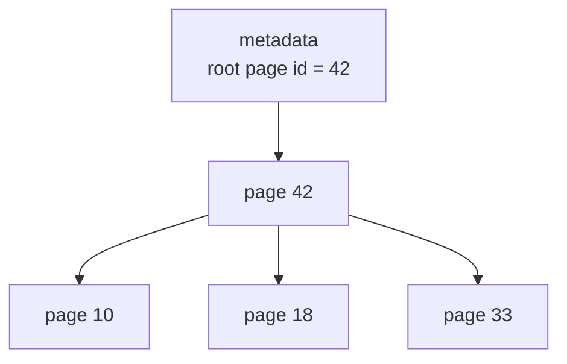
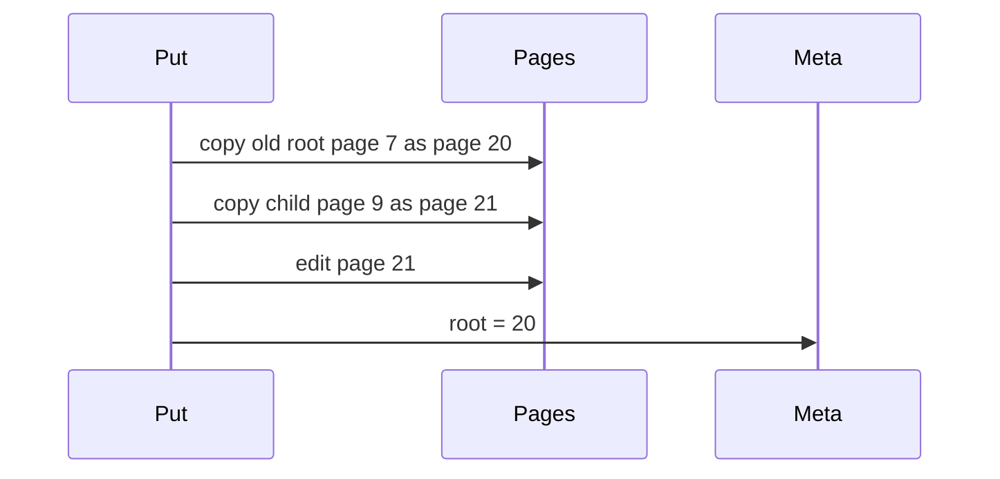
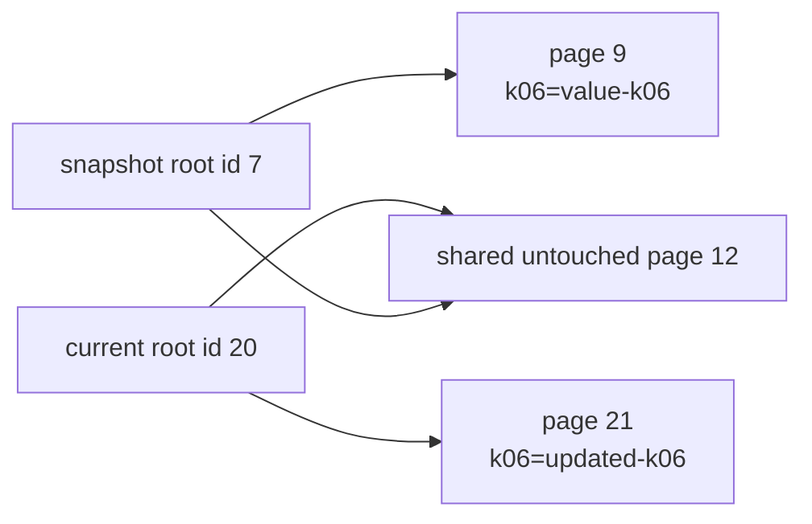

# 06. Page-backed Copy-on-Write Tree

The first package, `btree`, teaches the logical B-tree algorithm. The second package, `pagebtree`, makes the storage-engine idea more explicit: nodes are pages, pages have stable ids, writes allocate copied pages, and the current tree is published by changing the root page id.

## Why Add Pages?

Production B-trees usually do not point directly to heap objects. They point to pages.



This package still stores pages in memory, but the important boundary is now visible:

```go
type Tree struct {
    pages    map[PageID]*page
    root     PageID
    nextPage PageID
}
```

## Put and Get

The runnable demo is:

```bash
go run ./cmd/pagebtree-demo
```

Minimal usage:

```go
tree := pagebtree.New(2)
tree.Put("k01", []byte("value-01"))

value, ok := tree.Get("k01")
```

`Get` returns a copy of the stored bytes so callers cannot mutate page contents by holding a returned slice.

## Copy-on-Write With Page IDs

On every write:

1. Copy the root page to a new page id.
2. Descend toward the key.
3. Before descending into a child, copy that child to a new page id.
4. Split copied full pages as needed.
5. Publish the copied root id as the new root.



The old pages remain in the page map. A snapshot keeps its old root id and can still read the old path.

## Snapshot Proof



The test `TestSnapshotKeepsOldRootAfterCopyOnWritePuts` proves this behavior:

- Insert keys.
- Capture a snapshot.
- Replace old keys and add new keys.
- Confirm the snapshot still sees old values.
- Confirm the current tree has a different root page id.

## What Is Still Simplified?

The page package models page identity and root publication, but it is still intentionally readable:

- Page contents are Go slices, not encoded byte arrays.
- `PageSize` is a teaching constant, not an enforced allocator limit.
- Values live in internal pages too, so this is a B-tree rather than a B+tree.
- There is no deletion or disk persistence yet.

Those are good next exercises once the page-id copy-on-write mechanics are clear.
