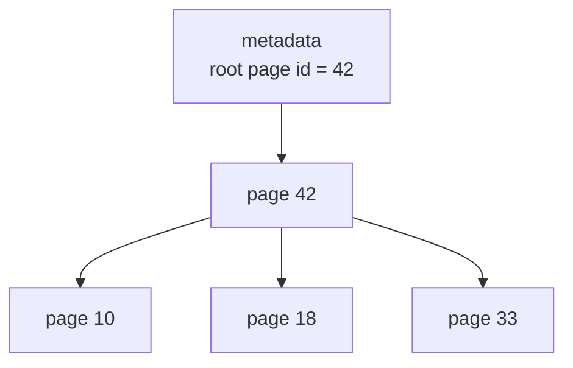
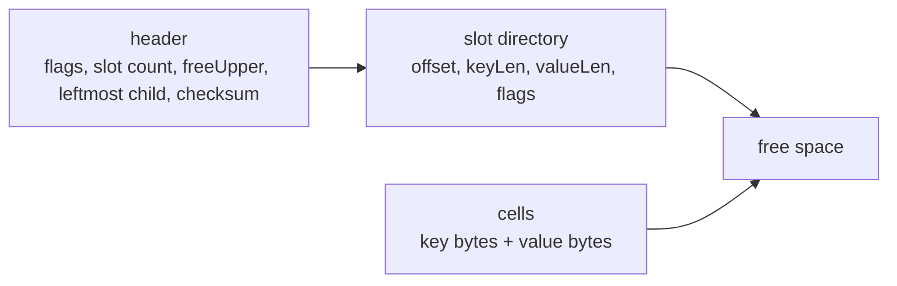
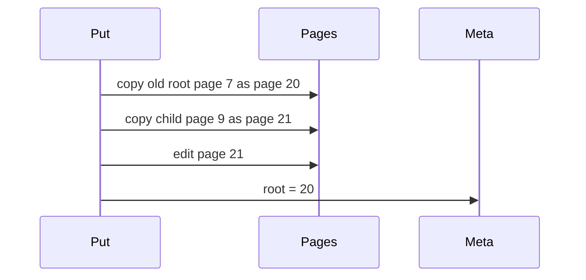
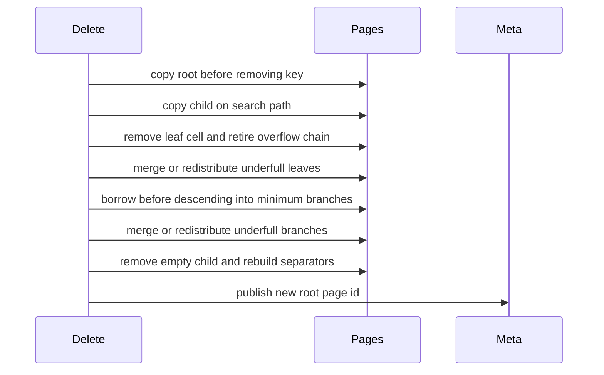
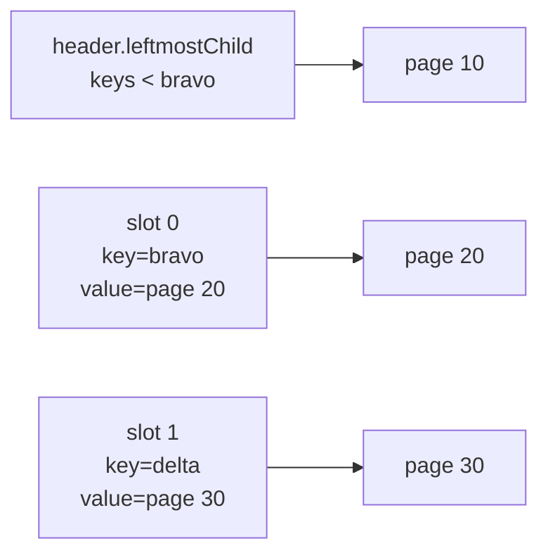
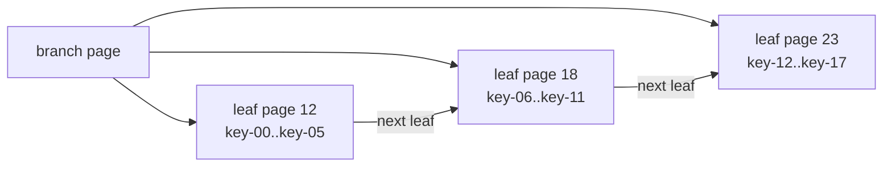
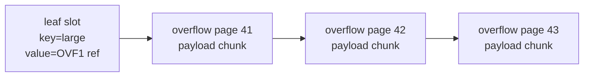
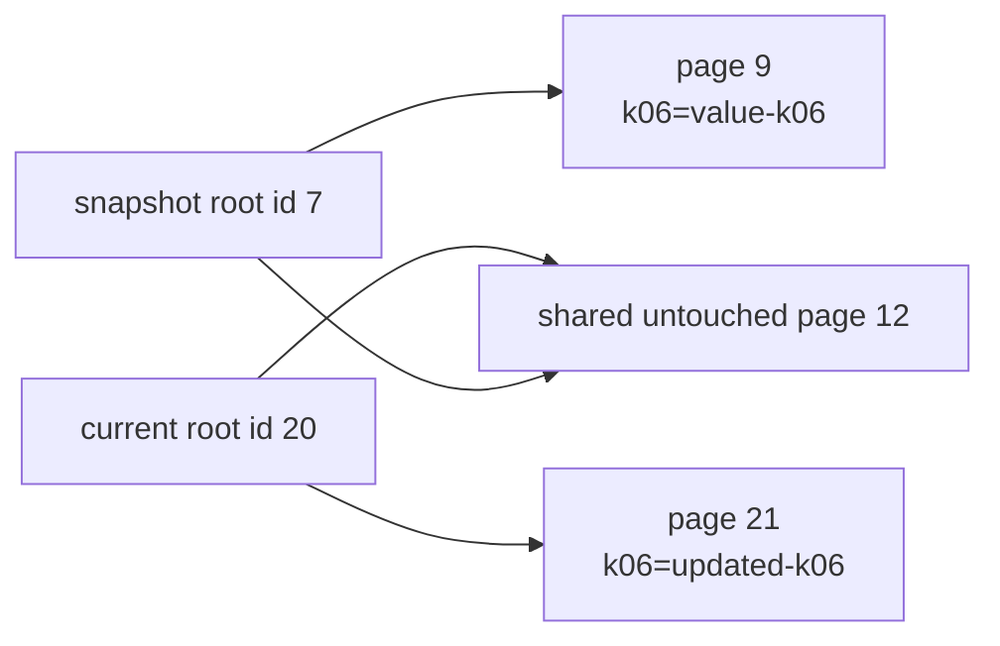

# 06. Page-backed Copy-on-Write Tree

The first package, `btree`, teaches the logical B-tree algorithm. The second package, `pagebtree`, makes the storage-engine idea more explicit: nodes are fixed-size slotted pages, pages have stable ids, writes allocate copied pages, and the current tree is published by changing the root page id.

## Why Add Pages?

Production B-trees usually do not point directly to heap objects. They point to pages.



This package still stores pages in memory, but the important boundary is now visible:

```go
type Tree struct {
    pages    map[PageID]*page
    root     PageID
    nextPage PageID
}
```

Each page uses the classic slotted-page shape:



The header and slots grow from the front of the page. Cells are copied from the end of the page backward. Leaf cells store key/value records. Branch cells store separator keys, and their value bytes encode the child page id to the right of that separator. The header also stores a CRC32 checksum over the rest of the page bytes.

A checksum says the bytes match the stored checksum; it does not prove the bytes make sense as a page. On mmap reopen, reachable pages must also pass structural validation before any cells are decoded: exactly one page kind, a slot directory inside the page, `freeUpper` between the slots and the cell area, cell ranges inside the cell area, no overlapping cells, sorted slot keys, legal slot flags, and branch child values that are exactly encoded page IDs. Fixed-payload pages such as overflow, freelist, and reclaim pages do not have a slot/cell area, so their unused `freeUpper` header field must stay at `PageSize`. After that, tree validation checks routing invariants such as "a tree page is reachable through only one parent path" and "each separator equals the first key of its right child."

Searching a page does not have to decode every cell into Go structs. The slot directory is already sorted by key, so `Get` can binary-search the slots, compare the query key against only the candidate cell key bytes, and then read only the selected value or child page id. Range scans use the same discipline: branch traversal compares separator keys before reading child page ids, and leaf traversal compares slot keys before reading value bytes.

## Put, Get, and Delete

The runnable demo is:

```bash
go run ./cmd/pagebtree-demo
```

Minimal usage:

```go
tree := pagebtree.New(2)
tree.Put("k01", []byte("value-01"))

value, ok := tree.Get("k01")
old, deleted := tree.Delete("k01")
tree.RangeFrom("k10", func(key string, value []byte) bool {
	return true
})
tree.RangeBetween("k10", "k20", func(key string, value []byte) bool {
	return true
})
```

`Get` and `Delete` return copies of stored bytes so callers cannot mutate page contents by holding a returned slice.

## Copy-on-Write With Page IDs

On every write:

1. Copy the root page to a new page id.
2. Descend toward the key.
3. On branch pages, binary-search separator slots and follow the selected child page id.
4. Before descending into a child, copy that child to a new page id.
5. Split copied full pages as needed.
6. Publish the copied root id as the new root.



The old pages remain in the page map. A snapshot keeps its old root id and can still read the old path.

Page IDs from copied old pages are not immediately reusable if a reader can still reach them. The next chapter covers reader-pinned recycling. The chapter after that moves the same page bytes into an mmap-backed file.

Delete follows the same copy-before-descend rule:



The implementation is intentionally conservative. Insertion chooses leaf and branch split points by encoded cell bytes. Deletion can repair a leaf or branch when it falls below the minimum key count, or when it is exactly at the minimum key count but has low byte occupancy. The low-fill trigger defaults to `DefaultMinRepairPageFillPercent` and can be tuned with `Options.MinRepairPageFillPercent` or `MmapOptions.MinRepairPageFillPercent`; a negative value disables the byte-fill trigger. When deletion must redistribute records or child pointers across two pages it chooses a byte-aware split point. It merges siblings only when their combined encoded bytes fit in one page; otherwise it redistributes even when the combined key count would be legal. Before descending into a minimum-fill branch it can borrow one child from a sibling. `Tree.Check` and mmap recovery enforce the result by rejecting non-root leaves or branches below `degree-1` keys. That demonstrates the important deletion shape change while keeping the code readable. The policy is still conservative rather than a production occupancy-target model.

## Walking Branch Pages

A branch page stores one special child in the header, then one child inside each separator cell value:



For a lookup:

- If the key is less than the first separator, walk `leftmostChild`.
- If the key equals a separator, walk the child page id stored in that separator cell.
- If the key falls between two separators, walk the child page id stored in the lower separator cell.
- If the key is greater than every separator, walk the child page id stored in the last separator cell.

That rule matches B+tree separator semantics: branch keys route the search, while actual values live in leaf pages.

The implementation writes separators as copies of the first key in the right child. That gives recovery a useful invariant: if slot `i` routes to child `i+1`, then slot `i`'s key should equal `firstKey(child[i+1])`. A branch page can therefore have valid bytes and a valid checksum but still be rejected if its routing no longer describes the reachable children.

## Linked Leaves

B+trees usually link leaf pages so a range scan can move from one leaf to the next without walking back up through parent branches. `pagebtree` stores the next leaf page id in the same header field that branch pages use for `leftmostChild`.



Copy-on-write makes leaf links more subtle than they first look. A copied leaf may still contain a link that was correct for an older root version. Relinking that leaf in place would rewrite page bytes that an active snapshot may still be able to see.

The implementation therefore relinks leaves reachable from the current root only when no readers are active. If a `Put` or `Delete` happens while a snapshot is open, the current root is still published immediately, but leaf-link repair is deferred. When the last snapshot closes, `Snapshot.Close` releases the reader pin and repairs the current leaf chain, marking changed mmap pages dirty.

Because leaf links are persisted in page headers, mmap recovery validates them too. The branch tree defines the authoritative sorted leaf order; each leaf's `nextLeaf` header must point to the next leaf in that order, and the final leaf must point to zero.

Current-tree `Range` uses the leaf chain when no active reader can make those links stale. `RangeFrom(start)` first descends the tree to the leaf that can contain `start`, then scans forward through linked leaves and skips entries below the lower bound. `RangeBetween(start, end)` uses the same lower-bound leaf descent, stops before the exclusive `end` key, and avoids prefetching linked leaves whose first key is already outside the bound. Inside each leaf, these scans walk slot entries directly instead of materializing every key/value cell first. If a reader is active, these methods fall back to the recursive branch walk so they still return the current keys even while link repair is deferred; that fallback also reads branch child ids directly from slots only for children it actually visits. Snapshot ranges keep the recursive walk because it preserves the old-root view directly.

## Overflow Values

Small values live directly inside leaf cells. A large value would crowd out the slot directory and make page splits about byte capacity instead of tree shape. To keep the research tree focused while still handling real byte slices, large values are stored in overflow pages:



The leaf slot carries an overflow flag. When that flag is set, the cell value is a small `OVF1` reference containing a nonzero first overflow page id and the logical value length. When the flag is not set, the cell value is ordinary user bytes, even if those bytes happen to start with `OVF1`. Each overflow page stores a payload chunk and the next overflow page id. `Get` follows that chain and returns a fresh byte slice to the caller.

On mmap reopen, the overflow reference and chain must agree exactly. A referenced overflow value must name a first page, and every referenced page in the chain must be an overflow page, not merely a valid checksummed leaf or branch page. A chain that contains fewer payload bytes than the reference length is truncated/corrupt. A chain that contains more payload bytes than the reference length is also suspicious: recovery would otherwise silently ignore bytes that are still reachable through the chain. The validator therefore requires the summed overflow payload length to equal the `OVF1` reference length.

Overflow pages are immutable once published. When a large value is replaced, the old overflow chain is retired with the same reader-pinned freelist rules as copied tree pages, so older snapshots can still read the old bytes until they close.

There is also a second overflow path for byte-full leaf pages. A value can be small enough to stay inline on its own, but several such values may not fit in one leaf page together. During a copied leaf rewrite, the implementation first tries the natural inline layout. If the page runs out of bytes, it spills the largest inline cell to overflow pages and retries until the leaf fits.

## Snapshot Proof



The test `TestSnapshotKeepsOldRootAfterCopyOnWritePuts` proves this behavior:

- Insert keys.
- Capture a snapshot.
- Replace old keys and add new keys.
- Confirm the snapshot still sees old values.
- Confirm the current tree has a different root page id.

## What Is Still Simplified?

The page package models page identity, root publication, and slotted cell storage, but it is still intentionally readable:

- Pages are kept in an in-memory map rather than written to disk.
- The implementation rewrites a copied page from decoded entries during insertion and deletion; it does not do in-place cell compaction.
- `Get`, branch range traversal, and bounded leaf scans search slots directly, but insertion still decodes page contents before rewriting the copied page.
- Current-tree `Range`, `RangeFrom`, and `RangeBetween` use next-leaf links only when no active reader can make them stale; snapshot ranges still use a recursive tree walk.
- Insertion and delete redistribution choose byte-aware leaf and branch split points, byte-full leaf rewrites spill inline cells to overflow pages, leaf/branch repair can trigger on configurable low byte occupancy at minimum key count, and merges require combined bytes to fit in one page.
- `Delete` removes records, retires overflow pages, borrows before descending into minimum-fill branches, merges or redistributes underfull leaves and branches, removes empty children, and collapses a one-child root.
- Branch pages contain separator keys and child page ids; values live in leaves.
- Disk persistence is introduced in the mmap chapter.

Those are good next exercises once the page-id copy-on-write and freelist mechanics are clear.
