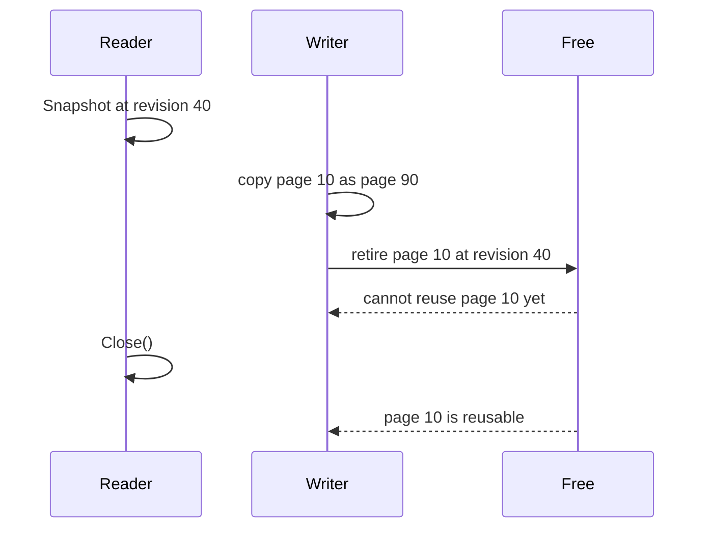
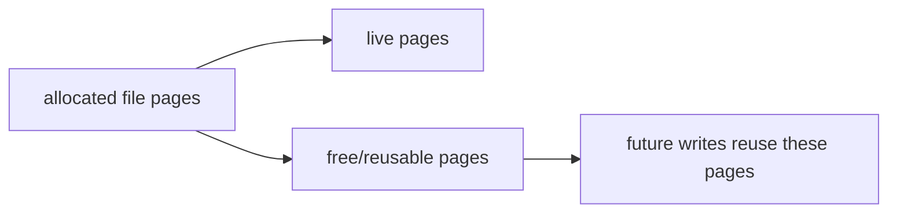

# 07. Freelist and Readers

Copy-on-write creates old pages. A storage engine needs a rule for when those old page IDs can be reused.

The rule in `pagebtree` is:

- A write copies pages on the path it changes.
- The copied-from page IDs are retired with the current tree revision.
- Open snapshots pin their revision.
- A retired page can move to the freelist only when no open snapshot can still read that revision.
- New writes allocate from the freelist before growing `nextPage`.

## Why Readers Matter

If page ID `10` is reused while an old reader still has a root that can reach page `10`, that reader may decode unrelated new data. The tree therefore tracks active read revisions.



## The Code Path

`Tree.Snapshot` begins a read transaction by registering the current revision. `Snapshot.Close` releases it.

```go
snapshot := tree.Snapshot()
defer snapshot.Close()
```

Because snapshots pin old page IDs, production-style code should close them as soon as the read is done.

`Tree.copyPage` is the retirement point. It allocates a new page ID, copies the old page bytes, then retires the old page ID. `reclaimRetiredPages` moves safe retired pages to the freelist. `allocPage` prefers the freelist before increasing `nextPage`.

For mmap-backed trees, an open snapshot also pins the file mapping itself. Snapshot pages are slices into the mapped file, so `Tree.Close` returns `ErrActiveReaders` instead of unmapping while a snapshot is active. Close the snapshots first, then close the tree handle. A `Snapshot` requested after `Tree.Close` is inert: it registers no reader and returns no keys.

## Why the Freelist Alone Still Grows

Recycling pages inside a database file does not usually shrink the file.

If a database has allocated 10,000 pages and you delete half the records, a CoW engine may eventually mark roughly half of those pages as reusable. That means future writes can reuse those page IDs instead of extending the file. It does not mean the operating system automatically sees a smaller file.



To reduce the file's physical size, an engine needs extra work such as compaction, vacuuming, truncating free pages at the end of the file, or punching sparse holes where the platform supports it. Internal freelist recycling controls future growth; it is not the same as returning already-allocated file space.

The mmap-backed chapter now includes two small forms of that extra work. `Tree.Compact` can release unused mapped capacity beyond `nextPage` and truncate a contiguous suffix of page IDs that are already safe in the freelist. `Tree.PunchFreeMmapPages` can, on supported filesystems, ask the filesystem to sparse-punch interior free extents without changing the logical file length. It skips pages still reachable from a fallback metadata root and pages still pinned by readers. Neither API moves live pages, so this is still recycling and physical-space experimentation, not full online vacuum.

## What This Project Models

This repository is still in memory, so `AllocatedPages` is a map size rather than a file size. The model is the same:

- `RetiredPages`: old page IDs waiting for readers to close.
- `FreePages`: page IDs safe to reuse.
- `ReusedPages`: count of allocations served from the freelist.
- `ReclaimPressure`: retired pages split by oldest-reader watermark into
  reader-pinned and immediately reclaimable counts.
- `AllocatedPages`: number of page IDs currently represented in the in-memory page table.

The tests in `pagebtree/freelist_test.go` prove that active readers prevent reuse and that closing readers releases retired pages to the freelist.

The next chapter maps the same page IDs into a real file with mmap, persists safe freelist IDs across close/reopen, spills large reusable lists into checked freelist pages, demonstrates explicit tail compaction, and adds experimental sparse punching for safe free pages. Because that freelist becomes durable metadata, reopen cannot trust it just because the metadata checksum matches. The mmap loader validates persisted reusable IDs before accepting a metadata candidate:

- every reusable page ID must be inside `[first tree page, nextPage)`
- no reusable page ID may appear twice
- no reusable page ID may still be reachable from the candidate root, one of its overflow chains, or the metadata-owned freelist-page chain

If any of those checks fail, the metadata candidate is rejected instead of letting a future write overwrite a live page.
