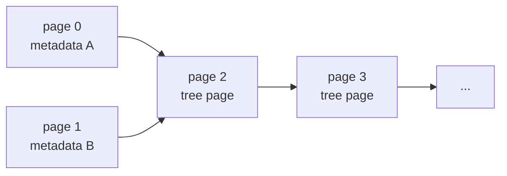
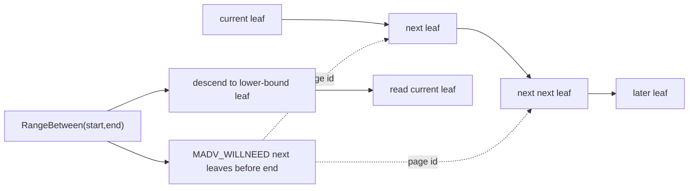
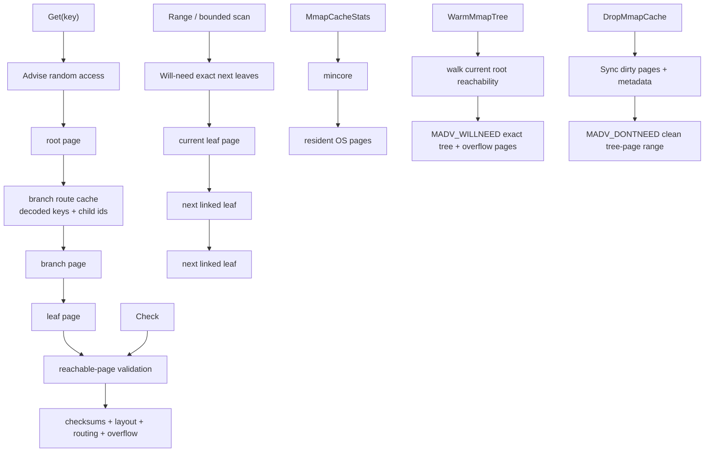
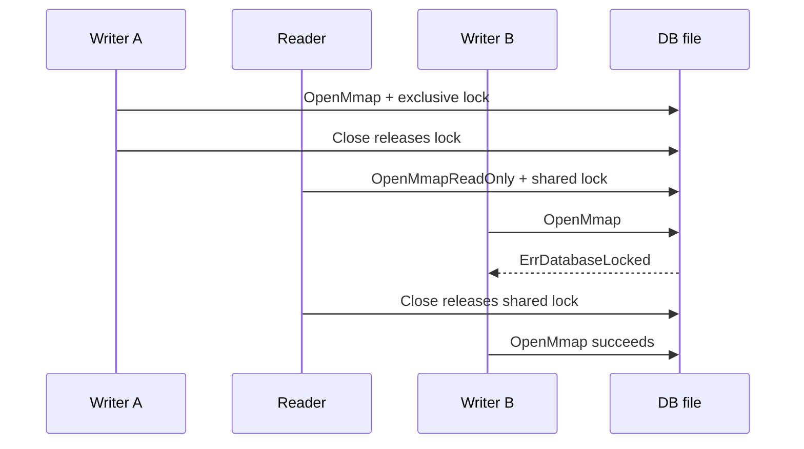

# 08. Mmap-backed Pages

The `pagebtree` package can now store pages in an mmap-backed file.

This is the first step from an in-memory model toward a real storage engine. The B+tree still uses the same slotted page layout, copy-on-write page allocation, snapshots, and reader-safe freelist mechanics. The difference is that page bytes can live inside a file mapping instead of Go heap arrays.

## Run It

```bash
go run ./cmd/mmapbtree-demo
```

The demo creates a temporary database file, inserts keys, deletes one key, closes the tree, reopens the file, and reads back through the B+tree search path.

## File Layout

The mmap file is page based:



Pages `0` and `1` are alternating metadata pages:

- magic bytes
- format version
- database page size
- root page id
- next page id
- length
- revision
- degree
- max page capacity
- reusable page IDs or a freelist-page root
- CRC32 checksum

`Sync` is the explicit durability boundary. Writable mmap pages are marked dirty when copy-on-write allocates or reuses their page IDs. `Sync` flushes those dirty tree and overflow page bytes first, then writes the metadata page selected by `revision % 2`, then flushes that metadata page. If the final metadata flush fails, the in-memory mapped metadata bytes are restored to their previous contents before the error is returned, so the handle does not keep advertising a metadata candidate that failed publication. `Close` calls `Sync` for writable trees. Because snapshots read slices backed by the mapping, mmap-backed `Close` returns `ErrActiveReaders` if in-process snapshots are still open; this keeps the mapping and file lock alive until readers release their handles. Once close succeeds, the arena clears the released byte slice, lock state, dirty-page set, and file handle so later code cannot accidentally keep using stale mmap resources. If close-time `Sync` fails but the arena still releases the mapping and lock, the tree handle is marked closed while the sync error is returned; later post-close calls stay inert instead of touching released mmap bytes. A `Snapshot` requested after `Close` is inert and does not register a reader, so it cannot touch unmapped page bytes. Post-close inspection and maintenance calls such as `Stats`, `Sync`, `Advise`, `DropMmapCache`, and `MmapCacheStats` are no-ops or zero-stat reads. On reopen, the tree validates metadata magic, version, database page size, degree, checksum, and freelist encoding before trying candidate records from newest to oldest. A candidate is usable only if its root and `nextPage` are inside both the mapped file and the metadata's declared capacity, the root and every reachable tree or overflow page pass validation, non-root leaves respect the persisted degree's minimum key count, the metadata length matches the reachable leaf-key count, and the persisted freelist is safe to reuse. If the newest metadata page is torn, corrupted, uses an unsupported format, page size, or degree, points at a torn root page, points outside the mapped file, contradicts its own capacity, stores the wrong logical length, contains an underfull non-root leaf, or names an unsafe reusable page, the older valid page can still point to a previous root.

Small reusable-page lists are stored directly in the metadata page. Once the list no longer fits there, version-2 metadata stores a freelist-page root instead. Freelist pages are normal checksummed database pages with a compact sequence of page IDs and a next-page pointer. `Sync` writes and flushes those freelist pages before publishing metadata that points at them, so reopen never follows an unsynced freelist root. Reopen checks that each persisted reusable page ID fits inside the metadata-declared capacity, is inside the allocated page range, appears only once, and is not reachable from the accepted root, its overflow chains, or the freelist-page chain itself. Because either of the two metadata pages may be the recovery point, old freelist-page generations become reusable only after neither valid metadata page still names their chain.

Tree pages start at page id `2`. The page id maps directly to a byte range:

```text
offset = pageID * PageSize
size   = PageSize
```

Tree pages and overflow pages also carry CRC32 checksums in their page headers. On reopen, `OpenMmap` walks the pages reachable from each metadata candidate root, including overflow chains referenced by leaf values, and rejects corruption before serving reads. Validation is deliberately layered: first the page checksum must match, then the page bytes must still form a legal layout, then branch routing must still describe a proper tree. Pages reached through the root and branch-child graph must be leaf or branch pages; a valid overflow page is still invalid in that graph. Leaf and branch pages validate their slotted-page structure before any key/value cells are decoded; overflow pages validate their payload length before the chain is followed, and referenced overflow chains must name a first page, must exist, must not loop, must contain only overflow pages, and must contain exactly the number of payload bytes recorded in the leaf's `OVF1` reference. Branch pages also reject missing child pages, duplicate child references, separators that do not match the first key of their right child, and child subtrees containing keys outside the half-open key interval assigned by the parent branch. Non-root leaf pages must also contain at least `degree-1` keys. Leaf pages reject next-leaf links that do not match the branch-order leaf sequence. If an older metadata candidate is still reachable and valid, it can be used as the recovery point.

The database page size is fixed at 4096 bytes for the lesson and stored in the metadata page. Existing files must be page-aligned and large enough to hold the two metadata pages plus the minimum tree-page capacity before they are mapped. Reopen rejects a valid-checksum metadata page that advertises a different page size instead of interpreting page IDs with the wrong geometry. The persisted degree must also be inside the range that a fixed slotted page can represent: it must be at least 2, and its maximum-key count must fit inside the page's slot directory capacity. The operating system's VM page size may be larger. The mmap sync helpers therefore align requested `msync` byte ranges to the OS page size before asking the kernel to flush them. Dirty logical pages are coalesced into contiguous ranges before `msync`, so a small write does not force the whole mapped file to flush.

The mapped file can grow and explicitly compact. `MmapOptions.MaxPages` sets the initial tree-page capacity for a new database. Creating a new mmap database writes initial metadata, syncs the file, and syncs the parent directory so the directory entry is part of the durability story. Existing databases reopen at their current file size, even if a larger `MaxPages` hint is passed; capacity grows later through page allocation. When copy-on-write allocation reaches the mapped capacity, the tree flushes dirty data pages without publishing new metadata, extends the file, syncs the file-size change and parent directory, creates a larger replacement mapping, and only then releases the old mapping. That order matters: if the replacement `mmap` fails, existing pages remain readable through the old mapping. If the replacement succeeds but releasing the old mapping fails, the growth path releases the replacement mapping and restores the previous file size before returning the error. After the swap succeeds, the tree rebinds in-memory page objects to their new byte ranges. The next `Sync` still controls when metadata publishes the new root and `nextPage`.

`Compact` is intentionally conservative. It first refuses to run while an in-process snapshot is active. Then it reclaims safe retired pages, lowers `nextPage` only across a contiguous suffix of free page IDs, persists the compacted metadata, truncates the file, syncs the file-size change and parent directory, and remaps the file down to the remaining capacity. If metadata publication fails, the temporary in-memory compaction state is restored before the error is returned. Like growth, shrink remapping acquires the replacement mapping before releasing the old mapping, so a failed replacement `mmap` does not leave the handle pointing at unmapped bytes; it also restores the previous file size before returning the failure. It can also release unused mapped capacity beyond `nextPage`, such as an oversized initial `MaxPages`. It never moves live pages, so interior reusable pages remain in the freelist for future writes.

## Why Mmap Helps

With mmap, the operating system maps file pages into the process address space. Code can read and write page bytes through memory loads and stores, while the OS page cache handles bringing file pages in and flushing dirty pages out.

That is one of the reasons B-trees pair well with page-oriented storage:

- tree nodes align with file pages
- branch nodes reduce random I/O by keeping the tree shallow
- hot pages stay in the OS page cache
- range scans can walk mostly sequential page memory

The important caching point is that mmap already uses the kernel page cache. Adding a second, broad Go heap page cache would often duplicate memory and fight the kernel. This project keeps page bytes in the mapping and adds access-pattern advice instead. On Linux, each public access hint is applied twice: `madvise` tells the virtual-memory mapping how the process expects to touch mapped bytes, and `posix_fadvise` tells the backing file's readahead policy what file offsets are likely or unlikely to be useful. Other Unix platforms keep the same API and teaching hooks, but file-level advice is a no-op when the portable syscall is not available.

- `MmapAccessDefault` uses the engine default, which is currently `MADV_RANDOM` plus Linux `FADV_RANDOM`. The zero-value option is intentionally point-lookup friendly.
- `MmapAccessRandom` also uses random advice. This tells Linux not to spend much effort on broad sequential readahead for root-to-branch-to-leaf point lookups.
- `MmapAccessSequential` uses sequential advice. Use it before range scans or bulk verification passes where nearby pages are likely to be read soon.
- `MmapAccessWillNeed` uses will-need advice. Use it as a prefetch hint before a known upcoming scan.
- `MmapAccessNormal` returns the mapping and, on Linux, the file to the kernel's normal policy for experiments or workloads where Linux's own heuristics are a better fit.

These are hints, not contracts. The kernel can ignore them or combine them with its own readahead heuristics. Correctness comes from the page checksums, copy-on-write roots, and metadata validation, not from prefetch behavior.

The package also exposes `WarmMmapTree()` and `DropMmapCache()`, which are intentionally separate from `Advise`. `WarmMmapTree` is not a broad access pattern. It follows the current B+tree root, branch children, leaf overflow references, and overflow chains, then issues `WILLNEED` only for the reachable page IDs it found. Adjacent page IDs are coalesced before calling the kernel, and reusable/free pages are skipped because they are not reachable from the current root. `Stats.MmapWarmupHints` and `Stats.MmapWarmupPages` show the number of hint calls and exact database pages covered.

`DropMmapCache()` is the opposite cache-pressure operation. Writable mmap trees call `Sync` first, then issue `DONTNEED` advice over the allocated tree-page range: `MADV_DONTNEED` for the mapping and, on Linux, `FADV_DONTNEED` for the backing file. Read-only mmap handles skip the sync and issue the advice directly. Use it after a batch job, verification pass, or demo experiment when you want to tell the kernel that these clean mapped pages do not need to stay resident.

## Coordinating With Linux Readahead

Linux already tries to detect sequential access on file-backed mappings. That is helpful for a table scan, but a B+tree point lookup is not a table scan: after the root, the next useful page is chosen by key comparison, not by physical page number. If we let the kernel assume too much sequential locality, it can pull unrelated pages into memory and evict pages we actually need.

The implementation therefore uses four rules:

- keep normal point lookups random-friendly with default `MADV_RANDOM` advice
- prefetch only exact page ranges when the tree knows the next pages, such as linked leaves during a range scan
- warm the current tree with `WarmMmapTree` when the caller explicitly wants reachable pages resident before a read-heavy phase
- avoid prefetch when the tree cannot prove the hint is still correct, such as while active readers have deferred leaf-link repair
- drop clean mapped pages only through the explicit `DropMmapCache` path, after writable state has been synced

This is why `OpenMmap` and `OpenMmapReadOnly` both apply random-access advice by default. `RangeFrom` and `RangeBetween` then first descend the tree to the correct lower-bound leaf and issue small will-need hints for a bounded window of linked next leaves. On Linux, those hints cover both the mapped address range and the matching file offsets. Adjacent leaf page IDs are coalesced into one exact half-open page range, so the tree avoids both broad whole-file guessing and avoidable one-page syscall chatter. The default window is `DefaultRangePrefetchLeafWindow` pages. `MmapOptions.RangePrefetchLeafWindow` can set a smaller or larger exact-page window, and a negative value disables linked-leaf prefetch entirely. These scans do not switch the whole mapping to sequential mode for ordinary bounded scans. Broad sequential advice remains available through `Tree.Advise` for explicit bulk passes, such as a full verification walk, where physical readahead is likely to be useful. `MmapAccessNormal` is available when you want to compare this policy against Linux's default readahead heuristics.

The project also has a small user-space page cache, but it deliberately does not cache raw page bytes. Raw bytes stay in the mmap region and the kernel page cache. The Go cache stores derived branch-routing metadata: decoded separator keys and child page IDs for branch pages reached by current-tree `Get`. Each entry is keyed by page ID plus the page checksum. If a page ID is later reused with different bytes, the checksum changes and the cache refreshes the decoded routing entry.

That derived cache is bounded with least-recently-used eviction. `DefaultPageCacheCapacity` is used unless a memory tree is created with `NewWithOptions` or an mmap tree is opened with `MmapOptions.PageCacheCapacity`. A negative capacity disables this derived cache, while still leaving raw bytes in the mmap and kernel page cache. `Stats` exposes `PageCacheCapacity`, `PageCacheEntries`, `PageCacheHits`, `PageCacheMisses`, `PageCacheInvalidations`, and `PageCacheEvictions` so this behavior is visible.

`Range`, `RangeFrom(start)`, and `RangeBetween(start, end)` now use the B+tree's leaf links to make smaller hints than a whole-file sequential policy. `RangeFrom` first walks the branch pages to the leaf that can contain `start`, so it avoids scanning the left side of the tree before the lower bound. `RangeBetween` also stops before the exclusive `end` key and does not prefetch a next leaf if that leaf's first key is already outside the requested interval. When no active reader has deferred leaf-link repair, the scan walks leaf-to-leaf and asks the kernel to prefetch the configured window of exact next leaf pages with `MADV_WILLNEED`; adjacent page IDs inside that window are coalesced into one `madvise` range. It does not ask Linux to guess far ahead across the whole mapping. If readers are active and current leaf links may be stale, the scan falls back to the recursive branch walk and skips leaf prefetch. `Stats.RangePrefetchLeafWindow`, `Stats.RangePrefetchHints`, and `Stats.RangePrefetchPages` make the configured window, successful hint-call count, and exact pages covered visible while experimenting.

`WarmMmapTree` is useful after opening a database or before a known read-heavy phase. It is more expensive than doing nothing because the tree must read page headers and child pointers to discover the exact reachable set, but that cost is deliberate: the hint is based on B+tree structure rather than Linux guessing from physical file offsets. It also includes reachable overflow pages, so large values are warmed with their leaf references, and it skips deleted/reusable pages even if they are still allocated inside the file.



The package also exposes `MmapCacheStats`, backed by `mincore` on Unix. This is an observability tool, not an application cache. It reports:

- mapped file bytes
- mapped database pages
- OS VM page size
- mapped OS page count
- resident OS page count

That lets learners see the distinction between the project's 4096-byte database pages and the kernel's VM pages. On some systems those sizes match; on others one OS page covers several database pages.

## Live Integrity Checks

`Tree.Check()` runs the reachable-page validator against the currently open tree. It verifies page checksums, slotted-page layout, branch child reachability, separator keys, subtree key bounds, non-root leaf minimum fill, overflow references and chains, length-vs-key-count consistency, and reusable-page safety. When no in-process reader is active, it also validates persisted leaf sibling links.

The active-reader exception is intentional. Current leaf-link repair is deferred while snapshots are open, because rewriting a copied page's sibling pointer in place could mutate bytes still visible to an older root. During that window, `Check()` validates the durable tree shape but skips the leaf-link invariant until the last reader closes and repair can run.

The same reachable-page checks are used during mmap metadata recovery. That means `Check()` is the live, explicit version of the safety gate that `OpenMmap` applies before accepting a recovered root.



## File Lock

`OpenMmap` takes a non-blocking exclusive advisory lock on the database file. A second writer attempting to open the same path receives `ErrDatabaseLocked` until the first tree closes.

`OpenMmapReadOnly` opens the same file with a shared advisory lock and a read-only mapping. Multiple read-only handles can coexist. A writer cannot open while any read-only handle is active, so cross-process readers are protected by the file lock rather than by a full reader table.



This keeps the teaching engine honest: the mmap implementation has one writer at a time, and read-only processes can inspect a stable root without taking write permission. It still does not allow one writer to keep progressing while independent external readers pin old pages through a reader table.

## What Is Still Not Production-grade

This chapter makes the project more serious, but it is still not a production database:

- freelist pages are reclaimed conservatively after both metadata slots advance, but there is still no full vacuum that moves live pages or punches sparse holes
- `Sync` flushes dirty data pages before metadata, and reopen can fall back from a torn newest root to an older valid root, but there is no complete crash-safe write-order protocol or WAL
- file creation, mapped file growth, and compaction sync file-size or directory-entry changes, but the project still does not model every filesystem or storage-device ordering edge case
- metadata pages, reachable tree pages, and reachable overflow pages are checksummed and validated for format, page size, degree, bounds, layout, routing, freelist safety, and key-count consistency, but there is no page-level repair
- read-only mmap handles use shared file locks, but there is no reader table that allows a concurrent writer to recycle pages around external readers
- overflow pages are linear chains, not a compact extent/tree structure
- byte-full leaf rewrites can spill cells to overflow pages, and key-underfull leaves can merge or redistribute with a sibling, but sibling redistribution is still key-count based
- `Get`, branch range traversal, and bounded leaf scans search slot directories directly, but insertion and deletion still rewrite copied pages from decoded entries
- `Delete` removes records, merges or redistributes underfull leaves, and collapses simple roots, but does not yet implement full branch-level sibling borrow/merge rebalancing
- `Compact` can truncate unused capacity and trailing free pages, but there is no full vacuum that moves live pages, rewrites page IDs, or punches sparse holes for interior free pages

The goal is to make mmap concrete without burying the learner under every database-engine concern at once.
