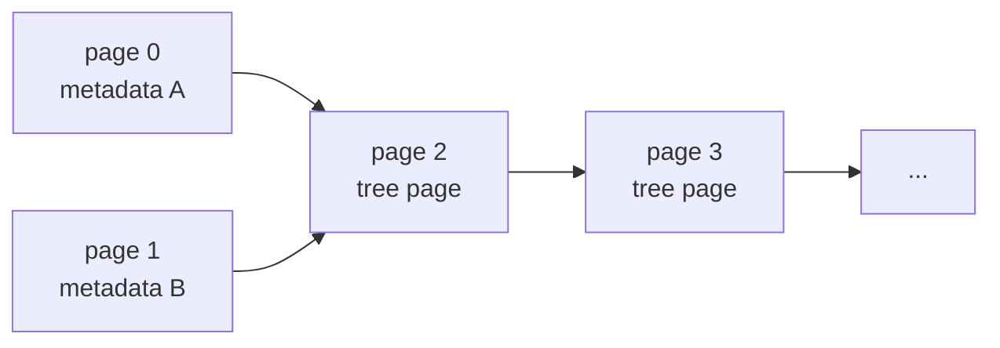

# 08. Mmap-backed Pages

The `pagebtree` package can now store pages in an mmap-backed file.

This is the first step from an in-memory model toward a real storage engine. The B+tree still uses the same slotted page layout, copy-on-write page allocation, snapshots, and reader-safe freelist mechanics. The difference is that page bytes can live inside a file mapping instead of Go heap arrays.

## Run It

```bash
go run ./cmd/mmapbtree-demo
```

The demo creates a temporary database file, inserts keys, closes the tree, reopens the file, and reads a key back through the B+tree search path.

## File Layout

The mmap file is page based:



Pages `0` and `1` are alternating metadata pages:

- magic bytes
- format version
- root page id
- next page id
- length
- revision
- degree
- max page capacity
- CRC32 checksum

Each commit writes the metadata page selected by `revision % 2`. On reopen, the tree validates both checksums and chooses the newest valid metadata page. If the newest metadata page is torn or corrupted, the older valid page still points to a previous root.

Tree pages start at page id `2`. The page id maps directly to a byte range:

```text
offset = pageID * PageSize
size   = PageSize
```

## Why Mmap Helps

With mmap, the operating system maps file pages into the process address space. Code can read and write page bytes through memory loads and stores, while the OS page cache handles bringing file pages in and flushing dirty pages out.

That is one of the reasons B-trees pair well with page-oriented storage:

- tree nodes align with file pages
- branch nodes reduce random I/O by keeping the tree shallow
- hot pages stay in the OS page cache
- range scans can walk mostly sequential page memory

## What Is Still Not Production-grade

This chapter makes the project more serious, but it is still not a production database:

- freelist state is not persisted across reopen yet
- writes call `msync`, but there is no complete crash-safe write-order protocol
- metadata pages are checksummed, but data pages are not
- there is no file lock
- there are no overflow pages for large records
- search still decodes page entries into small Go slices for readability
- page capacity is fixed at open time

The goal is to make mmap concrete without burying the learner under every database-engine concern at once.
