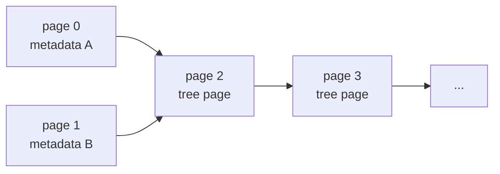
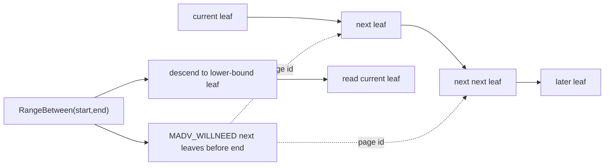
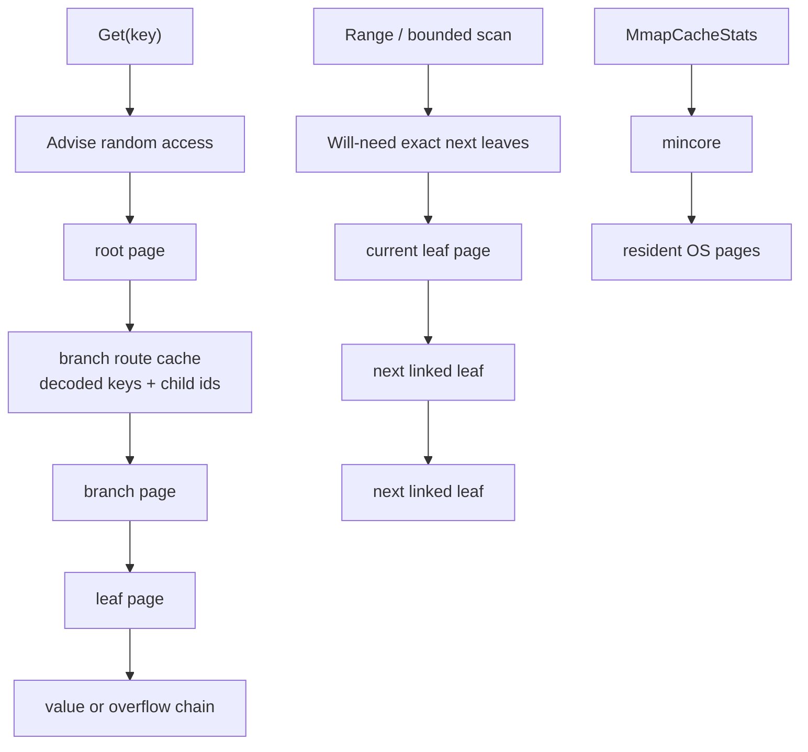
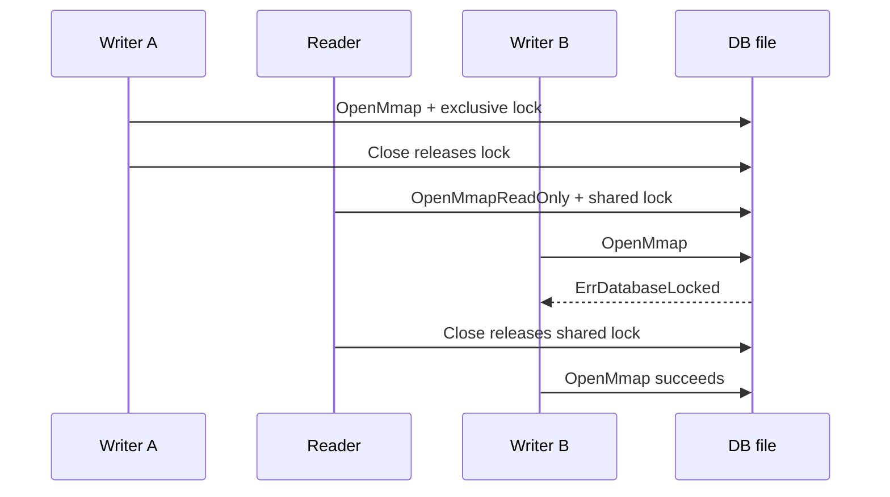

# 08. Mmap-backed Pages

The `pagebtree` package can now store pages in an mmap-backed file.

This is the first step from an in-memory model toward a real storage engine. The B+tree still uses the same slotted page layout, copy-on-write page allocation, snapshots, and reader-safe freelist mechanics. The difference is that page bytes can live inside a file mapping instead of Go heap arrays.

## Run It

```bash
go run ./cmd/mmapbtree-demo
```

The demo creates a temporary database file, inserts keys, deletes one key, closes the tree, reopens the file, and reads back through the B+tree search path.

## File Layout

The mmap file is page based:



Pages `0` and `1` are alternating metadata pages:

- magic bytes
- format version
- root page id
- next page id
- length
- revision
- degree
- max page capacity
- reusable page IDs
- CRC32 checksum

`Sync` is the explicit durability boundary. Writable mmap pages are marked dirty when copy-on-write allocates or reuses their page IDs. `Sync` flushes those dirty tree and overflow page bytes first, then writes the metadata page selected by `revision % 2`, then flushes that metadata page. `Close` calls `Sync` for writable trees. On reopen, the tree validates both metadata checksums, then tries candidate records from newest to oldest. A candidate is usable only if the root and every reachable tree or overflow page also pass validation. If the newest metadata page is torn, corrupted, or points at a torn root page, the older valid page can still point to a previous root.

The reusable page IDs are stored directly in the metadata page for now. That keeps the lesson compact and makes close/reopen freelist behavior visible. A larger database would usually store freelist records in normal pages and have metadata point to the freelist root.

Tree pages start at page id `2`. The page id maps directly to a byte range:

```text
offset = pageID * PageSize
size   = PageSize
```

Tree pages and overflow pages also carry CRC32 checksums in their page headers. On reopen, `OpenMmap` walks the pages reachable from each metadata candidate root, including overflow chains referenced by leaf values, and rejects corruption before serving reads. Validation is deliberately two-layered: first the page checksum must match, then the page bytes must still form a legal layout. Leaf and branch pages validate their slotted-page structure before any key/value cells are decoded; overflow pages validate their payload length before the chain is followed. If an older metadata candidate is still reachable and valid, it can be used as the recovery point.

The database page size is fixed at 4096 bytes for the lesson. The operating system's VM page size may be larger. The mmap sync helpers therefore align requested `msync` byte ranges to the OS page size before asking the kernel to flush them. Dirty logical pages are coalesced into contiguous ranges before `msync`, so a small write does not force the whole mapped file to flush.

The mapped file can grow. `MmapOptions.MaxPages` sets the initial tree-page capacity, and `OpenMmap` also honors any larger existing file on reopen. When copy-on-write allocation reaches the mapped capacity, the tree flushes dirty data pages without publishing new metadata, extends the file, creates a larger mapping, and rebinds the in-memory page objects to their new byte ranges. The next `Sync` still controls when metadata publishes the new root and `nextPage`.

## Why Mmap Helps

With mmap, the operating system maps file pages into the process address space. Code can read and write page bytes through memory loads and stores, while the OS page cache handles bringing file pages in and flushing dirty pages out.

That is one of the reasons B-trees pair well with page-oriented storage:

- tree nodes align with file pages
- branch nodes reduce random I/O by keeping the tree shallow
- hot pages stay in the OS page cache
- range scans can walk mostly sequential page memory

The important caching point is that mmap already uses the kernel page cache. Adding a second, broad Go heap page cache would often duplicate memory and fight the kernel. This project keeps page bytes in the mapping and adds access-pattern advice instead:

- `MmapAccessRandom` uses `madvise(MADV_RANDOM)`. This is the best default for point lookups because B+tree descent jumps from root to branch to leaf, and the next physical page is often unrelated.
- `MmapAccessSequential` uses `madvise(MADV_SEQUENTIAL)`. Use it before range scans or bulk verification passes where nearby pages are likely to be read soon.
- `MmapAccessWillNeed` uses `madvise(MADV_WILLNEED)`. Use it as a prefetch hint before a known upcoming scan.
- `MmapAccessDefault` returns the mapping to the kernel's normal policy.

These are hints, not contracts. The kernel can ignore them or combine them with its own readahead heuristics. Correctness comes from the page checksums, copy-on-write roots, and metadata validation, not from prefetch behavior.

The project also has a small user-space page cache, but it deliberately does not cache raw page bytes. Raw bytes stay in the mmap region and the kernel page cache. The Go cache stores derived branch-routing metadata: decoded separator keys and child page IDs for branch pages reached by current-tree `Get`. Each entry is keyed by page ID plus the page checksum. If a page ID is later reused with different bytes, the checksum changes and the cache refreshes the decoded routing entry. `Stats` exposes `PageCacheEntries`, `PageCacheHits`, `PageCacheMisses`, and `PageCacheInvalidations` so this behavior is visible.

`Range`, `RangeFrom(start)`, and `RangeBetween(start, end)` now use the B+tree's leaf links to make smaller hints than a whole-file sequential policy. `RangeFrom` first walks the branch pages to the leaf that can contain `start`, so it avoids scanning the left side of the tree before the lower bound. `RangeBetween` also stops before the exclusive `end` key and does not prefetch a next leaf if that leaf's first key is already outside the requested interval. When no active reader has deferred leaf-link repair, the scan walks leaf-to-leaf and asks the kernel to prefetch a small window of exact next leaf pages with `MADV_WILLNEED`. It does not ask Linux to guess far ahead across the whole mapping. If readers are active and current leaf links may be stale, the scan falls back to the recursive branch walk and skips leaf prefetch.



The package also exposes `MmapCacheStats`, backed by `mincore` on Unix. This is an observability tool, not an application cache. It reports:

- mapped file bytes
- mapped database pages
- OS VM page size
- mapped OS page count
- resident OS page count

That lets learners see the distinction between the project's 4096-byte database pages and the kernel's VM pages. On some systems those sizes match; on others one OS page covers several database pages.



## File Lock

`OpenMmap` takes a non-blocking exclusive advisory lock on the database file. A second writer attempting to open the same path receives `ErrDatabaseLocked` until the first tree closes.

`OpenMmapReadOnly` opens the same file with a shared advisory lock and a read-only mapping. Multiple read-only handles can coexist. A writer cannot open while any read-only handle is active, so cross-process readers are protected by the file lock rather than by a full reader table.



This keeps the teaching engine honest: the mmap implementation has one writer at a time, and read-only processes can inspect a stable root without taking write permission. It still does not allow one writer to keep progressing while independent external readers pin old pages through a reader table.

## What Is Still Not Production-grade

This chapter makes the project more serious, but it is still not a production database:

- freelist state is persisted in the metadata page, but only with a bounded educational encoding
- `Sync` flushes dirty data pages before metadata, and reopen can fall back from a torn newest root to an older valid root, but there is no complete crash-safe write-order protocol or WAL
- metadata pages, reachable tree pages, and reachable overflow pages are checksummed and structurally validated, but there is no page-level repair
- read-only mmap handles use shared file locks, but there is no reader table that allows a concurrent writer to recycle pages around external readers
- overflow pages are linear chains, not a compact extent/tree structure
- byte-full leaf rewrites can spill cells to overflow pages, but sibling redistribution is still key-count based
- `Get`, branch range traversal, and bounded leaf scans search slot directories directly, but insertion and deletion still rewrite copied pages from decoded entries
- `Delete` removes records and collapses simple roots, but does not yet implement full sibling borrow/merge rebalancing
- mmap files can grow by remapping, but there is no compaction or truncation of reusable pages at the end of the file

The goal is to make mmap concrete without burying the learner under every database-engine concern at once.
