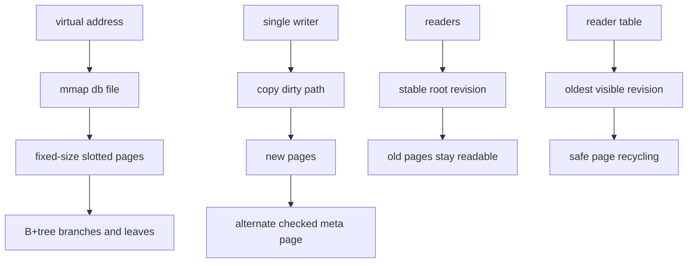
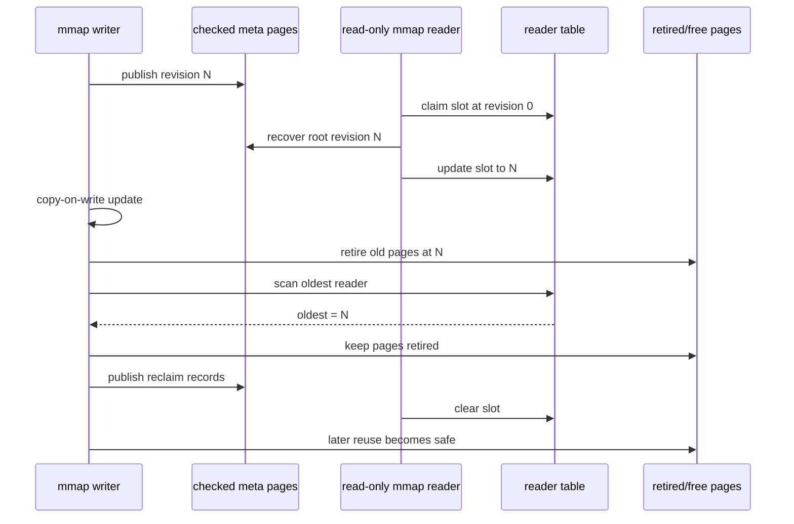
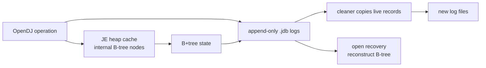
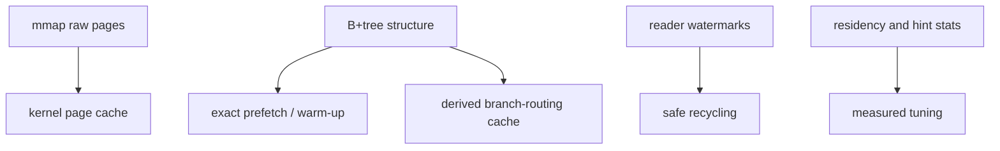

# 09. OpenLDAP, OpenDJ, and the Future Middle

This repository is a storage-engine research lab. Its reference line is the OpenLDAP MDB/LMDB design: a page-oriented B+tree in a memory-mapped file, updated by copy-on-write, published through checked metadata pages, and recycled through reader watermarks.

The contrast case is OpenDJ's Berkeley DB Java Edition lineage. OpenDJ stores directory data through a Java transactional B-tree backend where updates are appended to `.jdb` log files, internal nodes are managed in a Java heap cache, and cleaner/recovery work is part of the normal lifecycle.

Primary references:

- OpenLDAP MDB paper: <https://www.openldap.org/pub/hyc/mdb-paper.pdf>
- OpenLDAP administrator guide, `back-mdb`: <https://www.openldap.org/doc/admin24/backends.html>
- OpenLDAP LMDB API and caveats: <https://github.com/openldap/openldap/blob/master/libraries/liblmdb/lmdb.h>
- LMDB reader-lock table docs: <https://www.lmdb.tech/doc/group__readers.html>
- OpenDJ/Open Identity Platform backend storage notes: <https://doc.openidentityplatform.org/opendj/admin-guide/chap-import-export>
- OpenDS/OpenDJ Berkeley DB JE glossary: <https://docs.oracle.com/cd/E19476-01/821-0510/def-berkeley-db-java-edition.html>
- Oracle Berkeley DB Java Edition FAQ: <https://www.oracle.com/database/technologies/berkeleydb-je-faq.html>

## OpenLDAP LMDB Strategy

OpenLDAP's `mdb` backend is built on LMDB. The OpenLDAP administrator guide describes it as the recommended primary backend and notes the practical consequence: it uses no application-level cache and requires little search-performance tuning compared with older Berkeley DB backends. The LMDB API documentation states the storage idea directly: the database is exposed through a memory map, fetches return mapped data, pages use copy-on-write, writes are serialized, and readers run without blocking writers.

That combination is the state-of-practice design this repository studies:

- page IDs map directly to file offsets
- the OS page cache is the raw page cache
- database code does not duplicate raw page bytes in a heap cache
- writes copy modified pages instead of overwriting old pages
- a commit publishes a new root through alternating metadata pages
- readers hold a root revision and do not take tree latches
- one writer owns the write mutex
- old pages are recyclable only after no reader-table slot can still see them



The key research observation is that "mmap B+tree" is not enough. The kernel works because the pieces reinforce each other. Without copy-on-write, readers can observe overwritten bytes. Without checked metadata pages, recovery cannot distinguish the last stable root from a torn commit. Without reader watermarks, the writer cannot know when a retired page is safe to reuse. Without a deliberate page-cache policy, Linux readahead may do unhelpful guessing for random point lookups.

## Kernel Implemented Here

The `pagebtree` package implements the core of that OpenLDAP-style kernel in Go. It is not LMDB, and it does not try to clone LMDB's C API. It implements the storage mechanics that matter for study:

- fixed 4096-byte slotted pages with header, slot directory, and cells
- B+tree branch pages with separator keys and child page IDs
- linked leaf pages with inline values and overflow chains
- direct slotted-page point search and bounded range scans
- copy-on-write `Put` and `Delete`
- checked dual mmap metadata pages at page IDs `0` and `1`
- dirty data-page sync before metadata publication
- growable and compactable mmap file geometry
- one sidecar writer mutex
- read-only mmap handles with sidecar reader-table slots
- reader-pinned retired-page recycling
- checked freelist pages for large reusable-ID lists
- versioned reclaim pages for externally pinned retired records
- exact reachable-page warm-up and exact linked-leaf prefetch
- Linux `posix_fadvise` coordination alongside `madvise`
- `mincore` residency stats for observing kernel page-cache behavior
- a bounded derived branch-routing cache, not a raw page-byte cache

`Tree.MDBKernelProfile()` makes that kernel explicit at runtime:

```go
profile := tree.MDBKernelProfile()
fmt.Println(profile.Storage)                 // "mmap"
fmt.Println(profile.DualCheckedMetaPages)    // true
fmt.Println(profile.ReaderTable)             // true
fmt.Println(profile.KernelPageCache)         // true
fmt.Println(profile.RawHeapPageCache)        // false
fmt.Println(profile.DerivedBranchRoutingCache)
fmt.Println(profile.DerivedBranchRoutingCacheCapacity)
fmt.Println(profile.DerivedBranchRoutingCacheHits)
```

The demo in `cmd/mdbkernel-demo` opens a mapped database, writes keys, opens a read-only reader, mutates through the writer, and prints the profile plus reader-table state.



## OpenDJ and Berkeley DB JE

OpenDJ's JE backend explores a different design. The OpenDS/OpenDJ glossary describes Berkeley DB Java Edition as a pure Java transactional B-tree database used as the primary database for user data. The Open Identity Platform documentation describes JE backend files as append-only logs named like `number.jdb`; updates go to the highest-numbered log file, old log files are cleaned by copying still-active records forward, and recovery recreates the B-tree from logged state.

Oracle's JE FAQ makes the cache tradeoff precise. For read/write workloads, JE strongly benefits from enough heap cache to keep B-tree internal nodes for the active data set. If bottom internal nodes are not cached, operations can force random filesystem reads; when dirty internal nodes are evicted, they are appended to the log and later create cleaner work. Leaf record data can be handled differently, sometimes relying more on the filesystem cache to reduce JVM garbage collection cost.



The two designs optimize different problems:

- LMDB minimizes database-owned machinery: no raw heap page cache, no WAL, no background cleaner, direct mapped reads.
- JE fits a Java runtime model: managed objects, transactional logs, cleaner work, and explicit cache sizing.
- LMDB's hard problems are map sizing, long-lived readers, page reuse, crash-order publication, and reader-table hygiene.
- JE's hard problems are heap pressure, internal-node residency, log cleaning, checkpoint/recovery cost, and cleaner feedback loops.

## Future Middle

The modern middle is not to add a big database cache back on top of mmap. A more interesting direction is to keep the single-level-store shape while adding narrow, measurable structure:

- raw database bytes remain in mmap and the kernel page cache
- point lookups default to random access advice to reduce broad Linux readahead
- range scans issue exact `WILLNEED` hints for known linked leaves
- warm-up follows reachable tree and overflow pages, not the whole file
- derived routing metadata is cached by page checksum, bounded by LRU
- cache residency, warm-up hints, and prefetch hints are observable through stats
- recycling uses reader watermarks rather than global reader/writer exclusion
- background work stays optional and bounded



Open research tracks for this repo:

- replace the simple sidecar reader table with a cache-line-aligned mmap lock region
- add reader-table migration tooling for future incompatible sidecar formats
- model multi-database catalogs inside one mapped file
- make deletion byte-balanced, not only key-count balanced
- add a crash-order harness for metadata, freelist, reclaim, growth, and shrink
- investigate sparse-file hole punching for interior free extents without moving live pages
- compare exact structure-aware prefetch with Linux default readahead on large workloads
- benchmark derived branch-routing cache hit rates against pure direct slotted-page search

The intended direction sits between OpenLDAP MDB and OpenDJ JE: keep the small mmap/MVCC kernel, then add only the observability, exact prefetch, and derived metadata that can prove their value.
