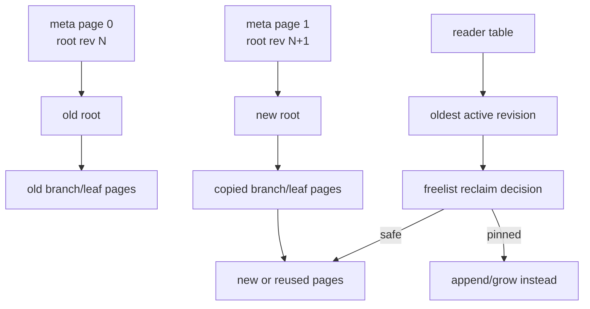
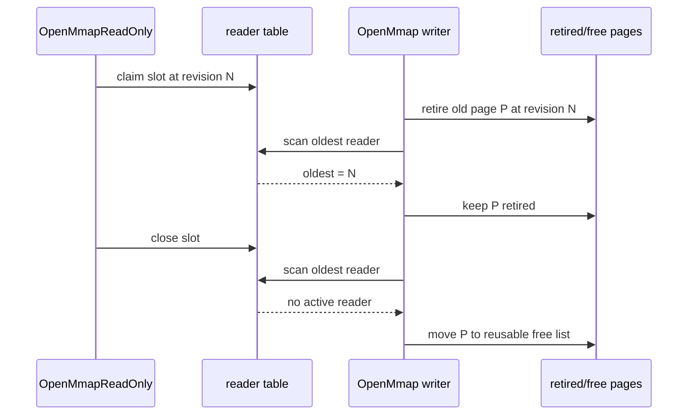
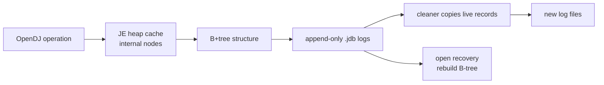

# 09. OpenLDAP, OpenDJ, and the Future Middle

This repository is now framed as a storage-engine research lab. The reference line is OpenLDAP's MDB/LMDB design, not a generic classroom B-tree: a page-oriented B+tree, mapped into process memory, updated through copy-on-write, and protected by metadata pages plus reader watermarks.

The contrast case is OpenDJ's JE backend lineage. OpenDJ stores directory data through Berkeley DB Java Edition, a transactional B-tree database implemented in Java. Its storage model relies on append-only `.jdb` log files; on open, the JE backend recreates its B-tree structure from those logs. Oracle's JE tuning notes emphasize that the heap cache should usually hold B-tree internal nodes for the active data set, because dirty internal nodes are written into the append-only log and later cleaned.

Primary references:

- OpenLDAP MDB paper: <https://www.openldap.org/pub/hyc/mdb-paper.pdf>
- OpenLDAP LMDB API and caveats: <https://github.com/openldap/openldap/blob/master/libraries/liblmdb/lmdb.h>
- LMDB reader-lock table docs: <https://www.lmdb.tech/doc/group__readers.html>
- Oracle Berkeley DB Java Edition FAQ: <https://www.oracle.com/database/technologies/berkeleydb-je-faq.html>
- OpenDJ/Open Identity Platform backend storage notes: <https://doc.openidentityplatform.org/opendj/admin-guide/chap-import-export>
- OpenDS/OpenDJ Berkeley DB JE glossary: <https://docs.oracle.com/cd/E19476-01/821-0510/def-berkeley-db-java-edition.html>

## OpenLDAP LMDB Strategy

LMDB is a single-level-store design. The database file is mapped into virtual memory; ordinary loads read database bytes, and the operating system page cache decides what is resident. The MDB paper describes the removal of database/backend cache layers as a central OpenLDAP improvement: fewer copies, fewer cache-tuning knobs, and fewer lock dependencies.

The kernel shape is:

- page IDs map directly to file offsets
- writes never overwrite the old snapshot's pages
- a writer copies modified pages and publishes a new root through alternating metadata pages
- readers keep using the root revision they opened
- the writer can recycle retired pages only when no reader table slot names an old enough revision
- writers are serialized by one writer mutex
- readers do not block the writer; they only delay page reuse

The important research point is that LMDB is not "mmap plus a B-tree" in isolation. The design works because mmap, copy-on-write, double-buffered metadata, a freelist, and a reader table all fit together. Remove the reader table and long-lived readers either block writers or risk page reuse corruption. Remove copy-on-write and readers can observe torn mutations. Remove checked metadata and recovery cannot choose a stable root.

## What This Repo Implements

The `pagebtree` package now implements the core kernel of that strategy in Go:

- fixed 4096-byte slotted pages with header, slot directory, and cells
- B+tree branch pages with separator keys and child page IDs
- leaf pages with key/value cells, linked leaves, and overflow chains
- copy-on-write `Put` and `Delete`
- checked dual mmap metadata pages at page IDs `0` and `1`
- dirty data-page sync before metadata publication
- persisted freelist metadata, including checked freelist spill pages
- reader-pinned recycling for in-process snapshots
- mmap read-only handles that claim sidecar reader-table slots
- one sidecar writer mutex, so one writer can coexist with read-only mmap readers
- conservative compaction that refuses to shrink while a reader-table slot is active
- `madvise`, Linux `posix_fadvise`, exact linked-leaf prefetch, explicit warm-up, explicit cache drop, and `mincore` residency stats

The new reader-table code lives in `pagebtree/reader_table_unix.go`. The writer sees it through `oldestReaderRevision` in `pagebtree/freelist.go`; that function combines local snapshots and mmap reader-table slots before retired pages move into the reusable free list. `OpenMmapReadOnly` claims a slot after metadata recovery chooses a root, then clears that slot on `Close`.

## OpenDJ and Berkeley DB JE

OpenDJ's JE backend is a different research point. It uses Berkeley DB Java Edition, which the OpenDS/OpenDJ glossary describes as a transactional B-tree database used as the primary database for user data. The Open Identity Platform docs describe JE backend storage as append-only log files named like `number.jdb`; a cleaner thread copies active records to new log files so old log files can be deleted, and recovery recreates the B-tree structure from those logs.

Oracle's JE FAQ explains the cache consequence: for read-write workloads, JE strongly recommends enough cache for B-tree internal nodes in the active data set. If bottom internal nodes are not cached, random operations fetch them from the filesystem; when dirty nodes are evicted, they are appended to the log and later create cleaner work. Leaf data can be handled differently, sometimes relying more on the filesystem cache to reduce JVM garbage collection pressure.

That is not worse or better in the abstract. It is a different compromise:

- JE gives Java-managed transactional storage with log cleaning and recovery.
- LMDB gives mapped pages, MVCC roots, no database-level page cache, and no background cleaner.
- JE must reason about heap cache sizing and cleaner feedback loops.
- LMDB must reason about map size, long-lived readers, and reader-table hygiene.

## The Future Middle

A modern middle path is not "add every cache back." The interesting direction is selective structure on top of a single-level store:

- keep raw page bytes in mmap and the kernel page cache
- cache only derived metadata that is expensive to decode, such as branch routing entries
- make prefetch exact and structure-aware, such as linked-leaf windows and reachable-page warm-up
- expose residency and hint counters so tuning can be measured
- use reader watermarks for page recycling rather than global reader/writer exclusion
- keep background work optional and bounded, not an always-on cleaner

This repository already takes that middle path in small form: raw bytes are not duplicated in a Go heap page cache, but decoded branch-routing metadata is cached by page checksum; point lookups default to random-friendly kernel advice, while bounded scans issue exact `WILLNEED` hints only for known next leaves.

Future research tracks:

- replace the simple sidecar reader table with a cache-line-aligned mmap lock region
- add stale-reader inspection APIs similar in spirit to LMDB reader checks
- model multi-database catalogs inside one mapped file
- make deletion byte-balanced, not only key-count balanced
- add a formal crash-order test harness for metadata, freelist, and growth/shrink ordering
- investigate sparse-file hole punching for interior free extents without moving live pages
- compare exact structure-aware prefetch against Linux default readahead on large workloads

The direction is intentionally between OpenLDAP MDB and OpenDJ JE: keep LMDB's small mmap/MVCC core, but add explicit observability and narrowly scoped derived caches where modern workloads benefit.
