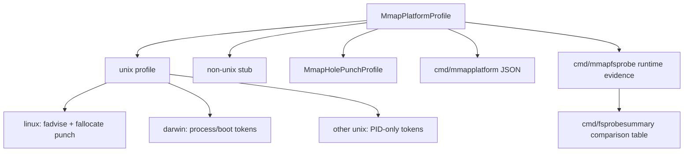

# Platform Matrix

This chapter records the current platform contract for the mmap-backed tree. It
is deliberately narrower than a production support statement: the matrix says
which mechanics are compiled and locally checked, while filesystem-specific
crash ordering, sparse allocation behavior, and kernel version behavior remain
experimental evidence problems.

The executable source of truth is `pagebtree.MmapPlatformProfile()`:

- Public profile shape: [`../pagebtree/platform_profile.go`](../pagebtree/platform_profile.go)
- Unix mmap profile: [`../pagebtree/platform_profile_unix.go`](../pagebtree/platform_profile_unix.go)
- Linux extras: [`../pagebtree/platform_profile_linux.go`](../pagebtree/platform_profile_linux.go)
- Darwin extras: [`../pagebtree/platform_profile_darwin.go`](../pagebtree/platform_profile_darwin.go)
- Other Unix fallback: [`../pagebtree/platform_profile_unix_other.go`](../pagebtree/platform_profile_unix_other.go)
- Non-Unix stub: [`../pagebtree/platform_profile_unsupported.go`](../pagebtree/platform_profile_unsupported.go)
- JSON command: [`../cmd/mmapplatform/main.go`](../cmd/mmapplatform/main.go)
- Runtime filesystem probe: [`../cmd/mmapfsprobe/main.go`](../cmd/mmapfsprobe/main.go)
- Probe summary command: [`../cmd/fsprobesummary/main.go`](../cmd/fsprobesummary/main.go)

Run:

```bash
go run ./cmd/mmapplatform
```

To collect local filesystem evidence for a disposable database path, run:

```bash
go run ./cmd/mmapfsprobe --keys 256 --value-bytes 512 /path/to/probe.db > probe.json
go run ./cmd/fsprobesummary probe.json > probe-summary.md
```

That probe creates a fresh mmap database, inserts fixed-size values, deletes
half the keys to create reusable pages, syncs, tail-compacts, attempts sparse
punching, and prints value-free JSON with `Stats`, `MmapSpaceStats`,
`MmapPlatformProfile`, and `MmapHolePunchStats` for each phase. It reports
filesystem allocation evidence from the actual path you give it, including
filesystem type, mount path, mount source, and mount options when the platform
exposes them; it still does not simulate sudden power loss or prove crash
ordering. `cmd/fsprobesummary` converts one or more saved probe JSON reports
into a stable Markdown table with one row each for insert, delete, compact, and
punch phases, including logical bytes, allocated bytes, sparse bytes, free page
counts, punched pages, filesystem identity, and mount identity. Keep the raw
JSON as the source of truth and use the Markdown summary for review notes or a
manual filesystem matrix.

## Current Matrix

| Platform family | mmap tree | Locks | reader table | owner tokens | file advice | cache/space stats | sparse punching |
| --- | --- | --- | --- | --- | --- | --- | --- |
| Linux | Supported through `mmap` | `flock` exclusive writer and shared read-only locks | Supported | PID, process-start from `/proc/<pid>/stat`, boot token from `/proc/sys/kernel/random/boot_id` | `posix_fadvise` plus `madvise` | `mincore`, `stat(2)`, numeric `statfs(2)` filesystem magic, and `/proc/self/mountinfo` mount metadata | `fallocate(PUNCH_HOLE|KEEP_SIZE)` |
| Darwin | Supported through `mmap` | `flock` exclusive writer and shared read-only locks | Supported | PID, process-start from `kern.proc.pid`, boot token from `kern.boottime` | `madvise`; file advice is a no-op in this lab | `mincore`, `stat(2)`, and named `statfs(2)` filesystem/mount metadata | Unsupported placeholder |
| Other Unix | Supported through `mmap` when Go and `x/sys/unix` provide the syscalls | `flock` exclusive writer and shared read-only locks | Supported | PID only; process-start and boot tokens are zero | `madvise`; file advice is a no-op in this lab | `mincore`, `stat(2)`, and filesystem identity where wired | Unsupported placeholder |
| Non-Unix | Not supported for mmap-backed files | Stubbed | Stubbed | Stubbed | Stubbed | Zero-value stubs | Unsupported/inert |

The generic in-memory B-tree and page-backed in-memory B+tree are portable Go
code. This chapter is only about the mmap-backed file path.



## What CI Proves

The GitHub Actions workflow has two layers:

- Native Linux `go test ./...` and `go vet ./...`.
- Cross-platform compile-only `go test -exec=/usr/bin/true ./...` for
  `linux/amd64`, `darwin/amd64`, `darwin/arm64`, `freebsd/amd64`, and
  `windows/amd64`.

The local equivalent is:

```bash
./scripts/ci-local.sh
```

Compile-only checks are still useful because build tags are part of the design:
Linux owns the active sparse-hole syscall, Darwin owns process and boot owner
tokens through `sysctl`, other Unix targets take PID-only fallbacks, and
non-Unix targets must keep the public API buildable through stubs. They do not
run the foreign test binaries, and they do not replace runtime testing on those
systems.

## Remaining Respectability Gap

A serious support matrix would need:

- Runtime tests on each supported operating system, not only cross-compilation.
- More recorded filesystem-specific probe runs for ext4, XFS, APFS, ZFS, tmpfs, and network filesystems, ideally saved as raw `mmapfsprobe` JSON plus `fsprobesummary` Markdown.
- Power-fail or VM-kill experiments per filesystem and mount option.
- Sparse-punch allocation evidence before and after maintenance on each filesystem.
- Long-running multi-process reader/writer soak runs outside `go test`.

Until that exists, the honest label is: **portable API, Unix-first mmap engine,
Linux-best sparse experiment, non-Unix stubs**.
