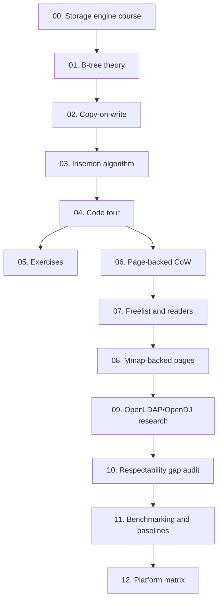

# OpenLDAP-Style mmap B+tree Research Lab

This folder is a research guide for the code in this repository. Read it as a small storage-engine notebook: each chapter introduces one mechanism, points back to the implementation, and keeps the OpenLDAP MDB/LMDB design line in view.

Start with the long course if you want the guided path with diagrams and direct code citations: [`00-storage-engine-course.md`](00-storage-engine-course.md).

## Research Goals

By the end, you should be able to explain:

- Why B-trees keep data shallow and cache-friendly.
- How node splits preserve sorted search.
- Why copy-on-write updates can keep old snapshots readable.
- What path copying shares, what it copies, and why.
- How the repository's `MDBKernelProfile` maps a live tree onto OpenLDAP-style mmap/MVCC mechanics.
- Why OpenLDAP's mmap/MVCC path differs from OpenDJ's Berkeley DB Java Edition log-and-cache path.
- Where this research implementation still differs from a production database index.

## Map



## Repository Layout

```text
btree/
  doc.go        Package overview
  node.go       Private node shape and cloning
  search.go     Lookup and ordered traversal
  insert.go     Path-copying insertion and splitting
  snapshot.go   Read-only historical roots
  stats.go      Small learning-oriented structure counters
  tree.go       Public Tree API

pagebtree/
  page.go       Slotted page header, slots, and cells
  page_cache.go Bounded derived branch-routing cache keyed by page checksum
  search.go     Point lookup, lower-bound/bounded range, recursive fallback range, and linked-leaf scans
  leaf_links.go Leaf sibling links for current root pages
  overflow.go   Overflow references and chained large-value pages
  tree.go       Root page publication
  insert.go     Page-copying insertion and B+tree-style splitting
  delete.go     Page-copying deletion and root collapse
  snapshot.go   Read-only historical root page ids
  freelist.go   Reader-pinned retired pages and reusable page IDs
  freelist_pages.go Checked freelist pages for large persisted reusable lists
  integrity.go  Public open-tree invariant checks
  mmap_readers.go Reader-table stats shape
  mmap_trace.go Public mmap trace event API
  mmap_trace_export.go JSONL trace exporter
  mmap_warm.go  Exact reachable-page mmap warm-up advice
  platform_profile.go Build-time mmap platform capability profile
  cursor.go     Snapshot-backed seek/next/prev, half-open bounds, and point delete
  kernel_profile.go OpenLDAP-style mmap kernel research profile
  reader_table_unix.go LMDB-style mmap reader table and writer mutex sidecars
  mmap.go       Mmap-backed page arena, metadata recovery, dirty sync, compact, tunable advice, cache stats, and locks

cmd/cowbtree/        Logical B-tree demonstration
cmd/pagebtree-demo/  Page-backed CoW demonstration
cmd/mmapbtree-demo/  Mmap persistence demonstration
cmd/mdbkernel-demo/  OpenLDAP-style mmap kernel profile demonstration
cmd/mmaptrace-demo/  JSONL mmap trace export demonstration
cmd/mmaptracesummary/ Markdown summary for value-free mmap trace JSONL
cmd/mmapinspect/     Read-only mmap audit JSON inspection tool
cmd/mmappunch/       Sparse-hole maintenance JSON with before/after space stats and optional trace export
cmd/mmapfsprobe/     Local filesystem probe for mmap logical/allocated space behavior
cmd/fsprobesummary/  Markdown summary for mmap filesystem probe JSON reports
cmd/mmaptxworkload/  Bounded mmap transaction commit/delete/conflict workload with optional trace export
cmd/mmaptxsummary/   Markdown summary for mmap transaction workload JSON reports
cmd/mmapplatform/    JSON platform capability report for mmap mechanics
cmd/benchsummary/    Markdown summary for Go benchmark output
docs/probes/    Redacted recorded filesystem probe artifacts and generated summary
docs/txworkloads/ Redacted recorded transaction workload artifacts and generated summary
docs/           Research chapters
```

## Suggested Reading Path

1. Read [`00-storage-engine-course.md`](00-storage-engine-course.md) for the end-to-end course, diagrams, and code citations.
2. Read the focused theory chapters once without opening the code.
3. Run `go test ./...` to see the behavior contract.
4. Read `btree/tree_test.go`; it is the executable specification.
5. Step through `Tree.Set` in `btree/tree.go`.
6. Run `go run ./cmd/pagebtree-demo` to see page root ids change across writes.
7. Read `docs/07-freelist-and-readers.md` to understand why old readers delay page reuse.
8. Run `go run ./cmd/mmapbtree-demo` to see keys survive close/reopen through mmap.
9. Read `docs/08-mmap-backed-pages.md` for mmap growth/compaction, reader-table recycling, kernel page-cache behavior, Linux file-advice coordination, derived branch-routing cache behavior, exact reachable-page warm-up, tunable exact-page prefetch advice, residency and file-space stats, sparse-hole capability reporting, and trace events.
10. Run `go run ./cmd/mmaptrace-demo > mmap-trace.jsonl` to inspect value-free JSONL trace events from a small mmap write/delete/compact workload.
11. Run `go run ./cmd/mmaptxworkload --transactions 12 --delete-every 2 --readers 2 --label local-tx --trace tx-trace.jsonl --redact-path /path/to/txworkload.db > tx-report.json`, summarize the JSON report with `go run ./cmd/mmaptxsummary tx-report.json`, and summarize the trace with `go run ./cmd/mmaptracesummary tx-trace.jsonl` to inspect commit-sync, staged-delete, reader-pinned reclaim pressure, and transaction-conflict events. Compare that workflow with the checked-in examples under [`txworkloads/`](txworkloads/).
12. Run `go run ./cmd/mmapinspect --readers --cache --space --pages --keys=4 --trace mmap-trace.jsonl /path/to/source.db` to print read-only audit JSON plus reader-table, cache-residency, file-space, sparse-hole capability, page-summary, bounded key-sample, and trace-correlation sections.
13. Run `go run ./cmd/mmappunch --trace punch-trace.jsonl /path/to/source.db` to execute sparse-hole maintenance, print before/after file-space evidence, and write value-free maintenance trace events.
14. Read `docs/09-openldap-opendj-research.md` for the OpenLDAP LMDB/MDB versus OpenDJ Berkeley JE comparison and future research directions.
15. Read [`10-respectability-gap-audit.md`](10-respectability-gap-audit.md) for the blunt gap list and next research slices.
16. Read [`11-benchmarking-and-baselines.md`](11-benchmarking-and-baselines.md), run a benchmark pass, and summarize it with `go run ./cmd/benchsummary bench.out`.
17. Read [`12-platform-matrix.md`](12-platform-matrix.md), run `go run ./cmd/mmapplatform` to inspect the current build's mmap support envelope, then run `go run ./cmd/mmapfsprobe --keys 256 --value-bytes 512 --label local-fs --redact-path /path/to/probe.db > probe.json` and `go run ./cmd/fsprobesummary probe.json` on a disposable path to collect local filesystem space evidence. Compare that workflow with the checked-in examples under [`probes/`](probes/).
18. Change the degree in the demos and observe how `Stats` changes.
