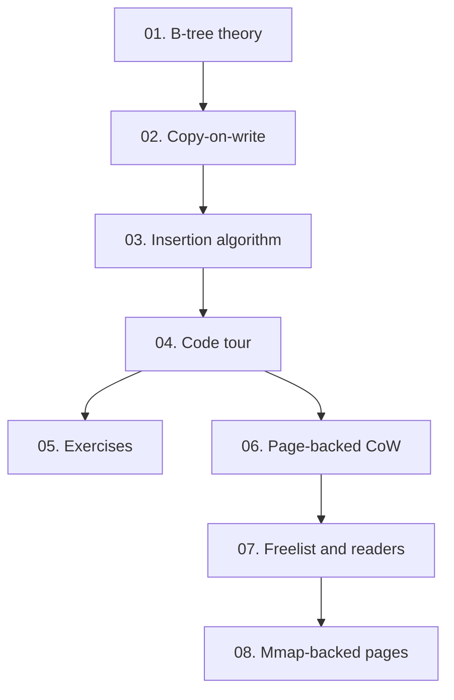

# Copy-on-Write B-tree Course

This folder is a guided course for the code in this repository. Read it as a small book: each chapter introduces one idea, then points back to the exact implementation files.

## Learning Goals

By the end, you should be able to explain:

- Why B-trees keep data shallow and cache-friendly.
- How node splits preserve sorted search.
- Why copy-on-write updates can keep old snapshots readable.
- What path copying shares, what it copies, and why.
- Where this teaching implementation differs from a production database index.

## Map



## Repository Layout

```text
btree/
  doc.go        Package overview
  node.go       Private node shape and cloning
  search.go     Lookup and ordered traversal
  insert.go     Path-copying insertion and splitting
  snapshot.go   Read-only historical roots
  stats.go      Small learning-oriented structure counters
  tree.go       Public Tree API

pagebtree/
  page.go       Slotted page header, slots, and cells
  page_cache.go Bounded derived branch-routing cache keyed by page checksum
  search.go     Point lookup, lower-bound/bounded range, recursive fallback range, and linked-leaf scans
  leaf_links.go Leaf sibling links for current root pages
  overflow.go   Overflow references and chained large-value pages
  tree.go       Root page publication
  insert.go     Page-copying insertion and B+tree-style splitting
  delete.go     Page-copying deletion and root collapse
  snapshot.go   Read-only historical root page ids
  freelist.go   Reader-pinned retired pages and reusable page IDs
  mmap.go       Mmap-backed page arena, metadata recovery, dirty sync, compact, tunable advice, cache stats, and file locks

cmd/cowbtree/        Logical B-tree demonstration
cmd/pagebtree-demo/  Page-backed CoW demonstration
cmd/mmapbtree-demo/  Mmap persistence demonstration
docs/           Course chapters
```

## Suggested Reading Path

1. Read the theory once without opening the code.
2. Run `go test ./...` to see the behavior contract.
3. Read `btree/tree_test.go`; it is the executable specification.
4. Step through `Tree.Set` in `btree/tree.go`.
5. Run `go run ./cmd/pagebtree-demo` to see page root ids change across writes.
6. Read `docs/07-freelist-and-readers.md` to understand why old readers delay page reuse.
7. Run `go run ./cmd/mmapbtree-demo` to see keys survive close/reopen through mmap.
8. Read `docs/08-mmap-backed-pages.md` for mmap growth/compaction, kernel page-cache behavior, Linux file-advice coordination, derived branch-routing cache behavior, tunable exact-page prefetch advice, and residency stats.
9. Change the degree in the demos and observe how `Stats` changes.
